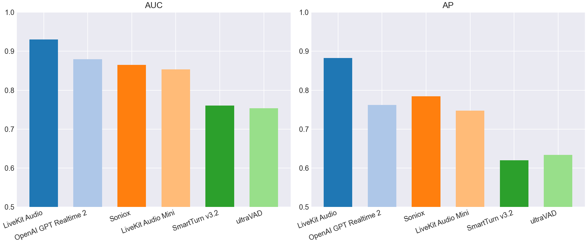
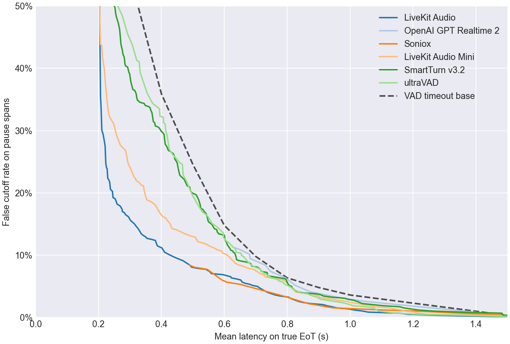
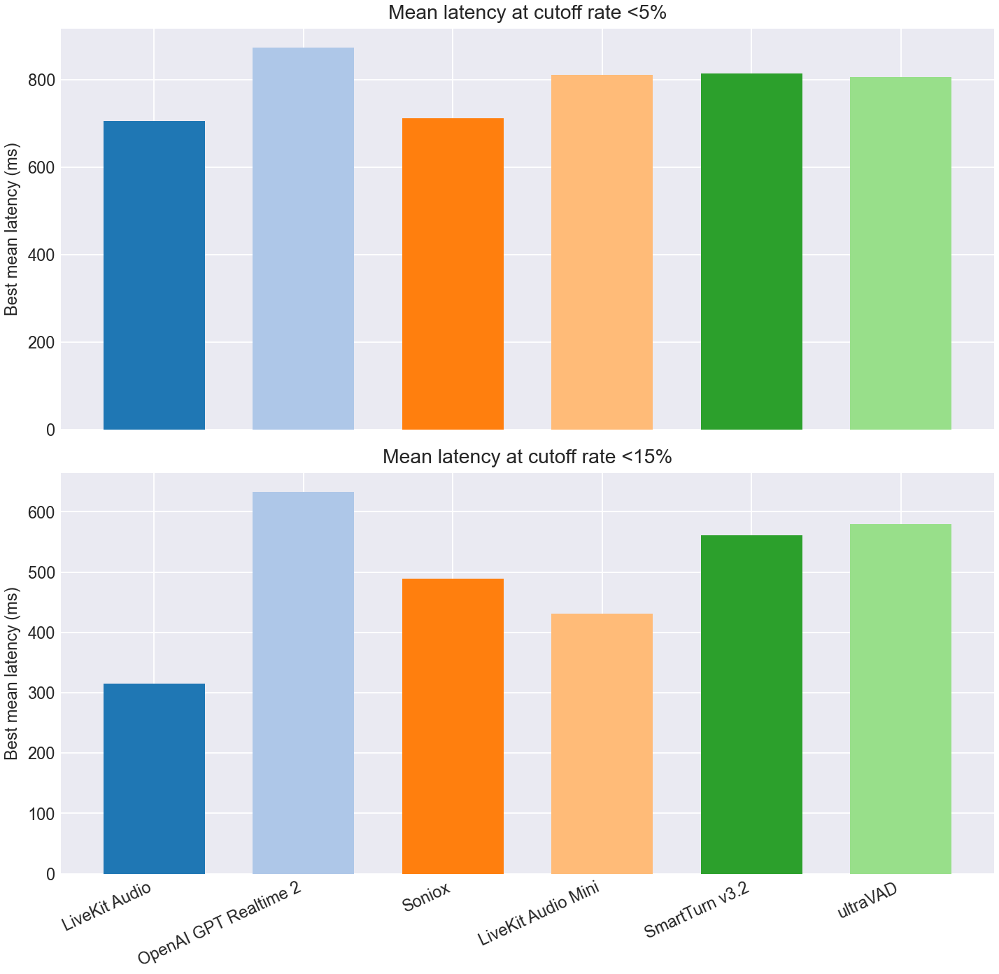
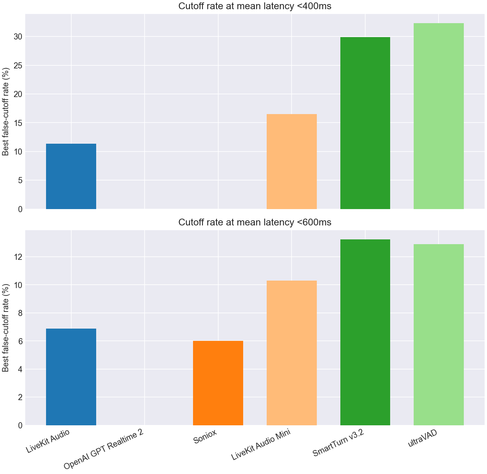

# EoT Model Comparison

## Classification Metrics Bar Charts

## Classification Metrics Table

| Model | Score Summary | Spans | AUC | AP | Mean Frontier Latency 0-10% |
| --- | --- | --- | --- | --- | --- |
| LiveKit Turn Detector v1 | 0.200 | 963 | 0.930 | 0.883 | 0.749 |
| OpenAI GPT Realtime 2 | max | 963 | 0.879 | 0.762 | 1.021 |
| Soniox | max | 963 | 0.865 | 0.785 | 0.805 |
| LiveKit Turn Detector v1-mini | 0.200 | 963 | 0.853 | 0.747 | 0.885 |
| SmartTurn v3.2 | 0.200 | 963 | 0.760 | 0.620 | 0.931 |
| ultraVAD | 0.200 | 963 | 0.753 | 0.634 | 0.882 |

## Pareto Curve

## Cutoff Budgets 5%, 15%

## Latency Budgets 400ms, 600ms

## Operating Points

| Type | Budget | Model | Mean Latency | Cutoff | Detect | Threshold | Action Delay | Timeout |
| --- | --- | --- | --- | --- | --- | --- | --- | --- |
| Cutoff | 5.0% | LiveKit Turn Detector v1 | 0.706 | 5.0% | 72.2% | 0.790 | 0.400 | 1.500 |
| Cutoff | 5.0% | OpenAI GPT Realtime 2 | 0.873 | 4.1% | 90.8% | 0.990 | 0.800 | 1.500 |
| Cutoff | 5.0% | Soniox | 0.713 | 4.5% | 79.3% | 0.990 | 0.500 | 1.500 |
| Cutoff | 5.0% | LiveKit Turn Detector v1-mini | 0.811 | 5.0% | 98.4% | 0.120 | 0.800 | 1.500 |
| Cutoff | 5.0% | SmartTurn v3.2 | 0.814 | 5.0% | 92.9% | 0.090 | 0.800 | 1.000 |
| Cutoff | 5.0% | ultraVAD | 0.807 | 5.0% | 86.6% | 0.070 | 0.700 | 1.500 |
| Cutoff | 15.0% | LiveKit Turn Detector v1 | 0.315 | 14.9% | 85.6% | 0.610 | 0.200 | 1.000 |
| Cutoff | 15.0% | OpenAI GPT Realtime 2 | 0.633 | 11.2% | 90.0% | 0.990 | 0.200 | 1.000 |
| Cutoff | 15.0% | Soniox | 0.489 | 8.4% | 79.3% | 0.990 | 0.200 | 1.000 |
| Cutoff | 15.0% | LiveKit Turn Detector v1-mini | 0.430 | 14.6% | 81.4% | 0.380 | 0.300 | 1.000 |
| Cutoff | 15.0% | SmartTurn v3.2 | 0.560 | 14.9% | 87.9% | 0.250 | 0.500 | 1.000 |
| Cutoff | 15.0% | ultraVAD | 0.580 | 14.4% | 70.1% | 0.140 | 0.400 | 1.000 |
| Latency | 400ms | LiveKit Turn Detector v1 | 0.393 | 11.3% | 75.9% | 0.750 | 0.200 | 1.000 |
| Latency | 400ms | OpenAI GPT Realtime 2 | - | - | - | - | - | - |
| Latency | 400ms | Soniox | - | - | - | - | - | - |
| Latency | 400ms | LiveKit Turn Detector v1-mini | 0.399 | 16.5% | 85.8% | 0.310 | 0.300 | 1.000 |
| Latency | 400ms | SmartTurn v3.2 | 0.399 | 29.9% | 75.1% | 0.670 | 0.200 | 1.000 |
| Latency | 400ms | ultraVAD | 0.395 | 32.3% | 75.6% | 0.120 | 0.200 | 1.000 |
| Latency | 600ms | LiveKit Turn Detector v1 | 0.596 | 6.9% | 69.6% | 0.800 | 0.200 | 1.500 |
| Latency | 600ms | OpenAI GPT Realtime 2 | - | - | - | - | - | - |
| Latency | 600ms | Soniox | 0.592 | 6.0% | 79.3% | 0.990 | 0.200 | 1.500 |
| Latency | 600ms | LiveKit Turn Detector v1-mini | 0.596 | 10.3% | 80.8% | 0.390 | 0.500 | 1.000 |
| Latency | 600ms | SmartTurn v3.2 | 0.600 | 13.2% | 80.1% | 0.510 | 0.500 | 1.000 |
| Latency | 600ms | ultraVAD | 0.597 | 12.9% | 80.6% | 0.100 | 0.500 | 1.000 |
