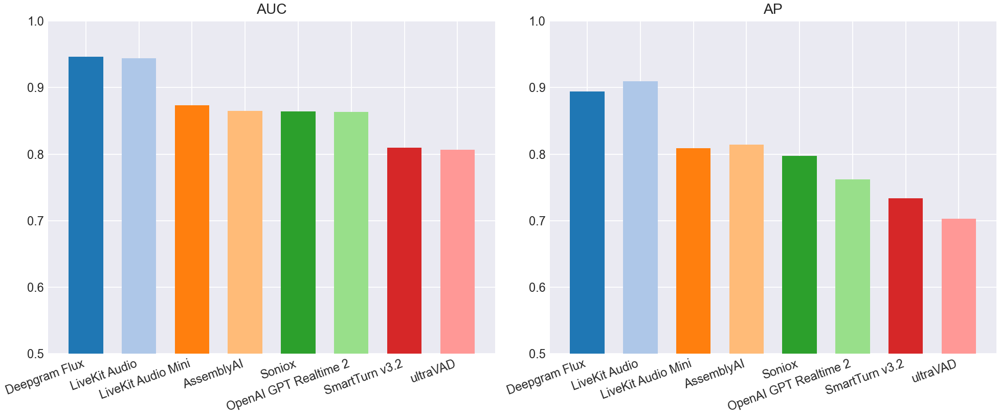
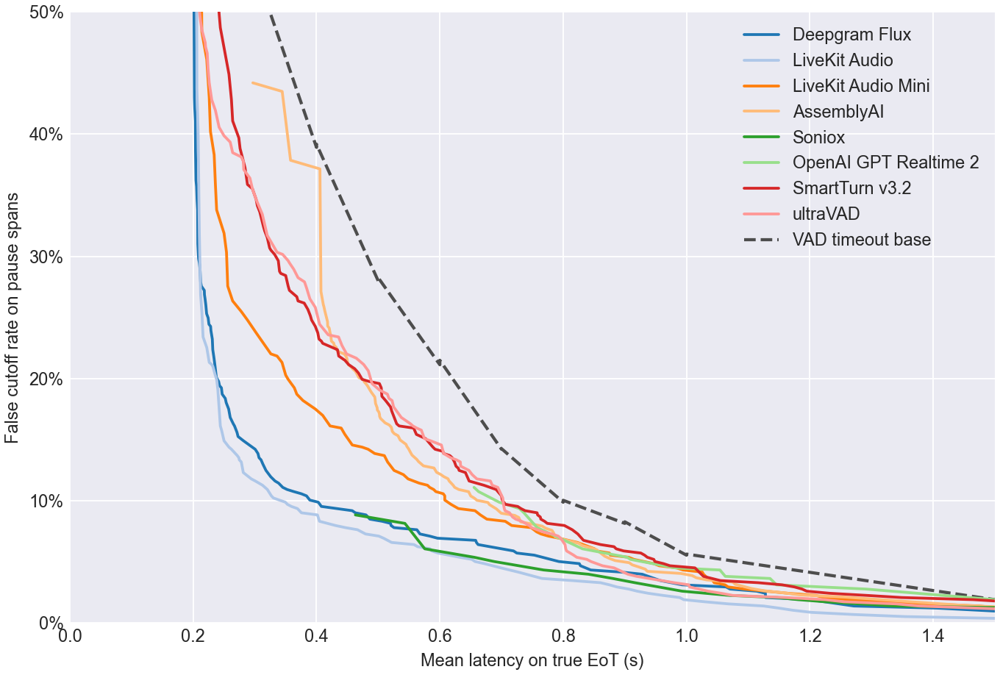
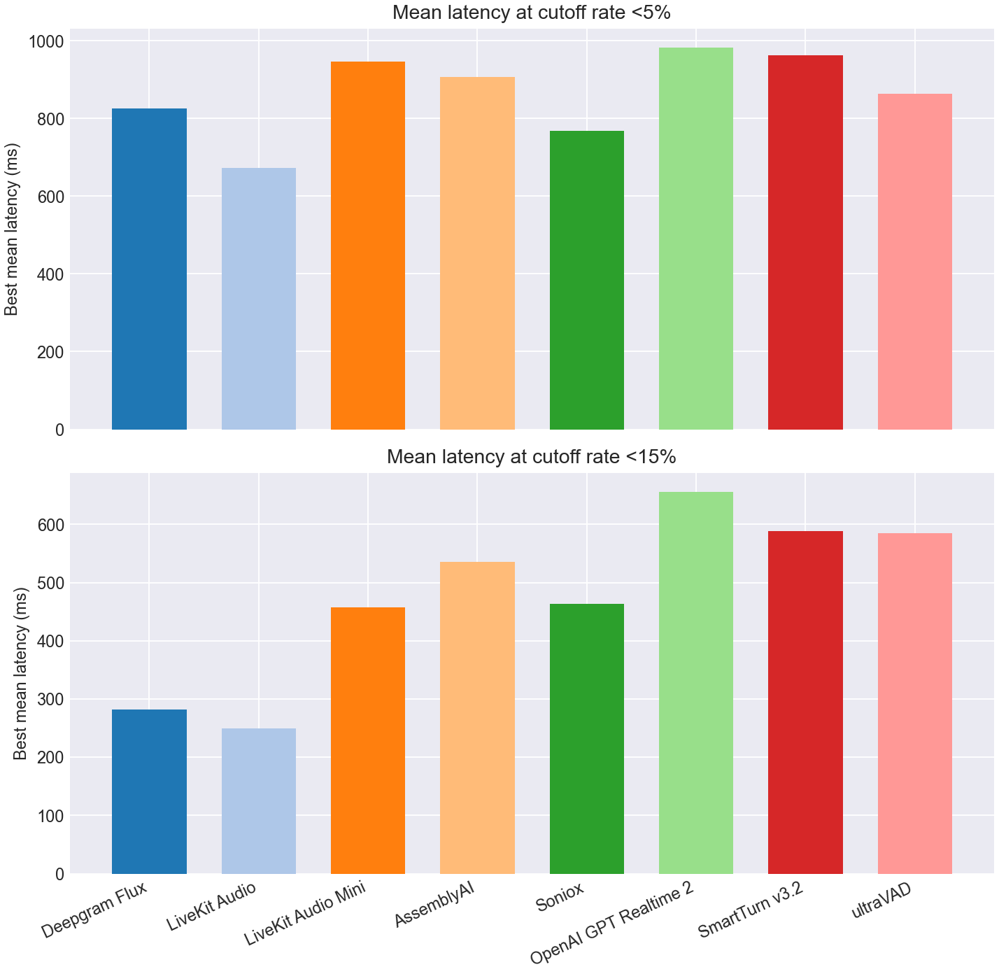
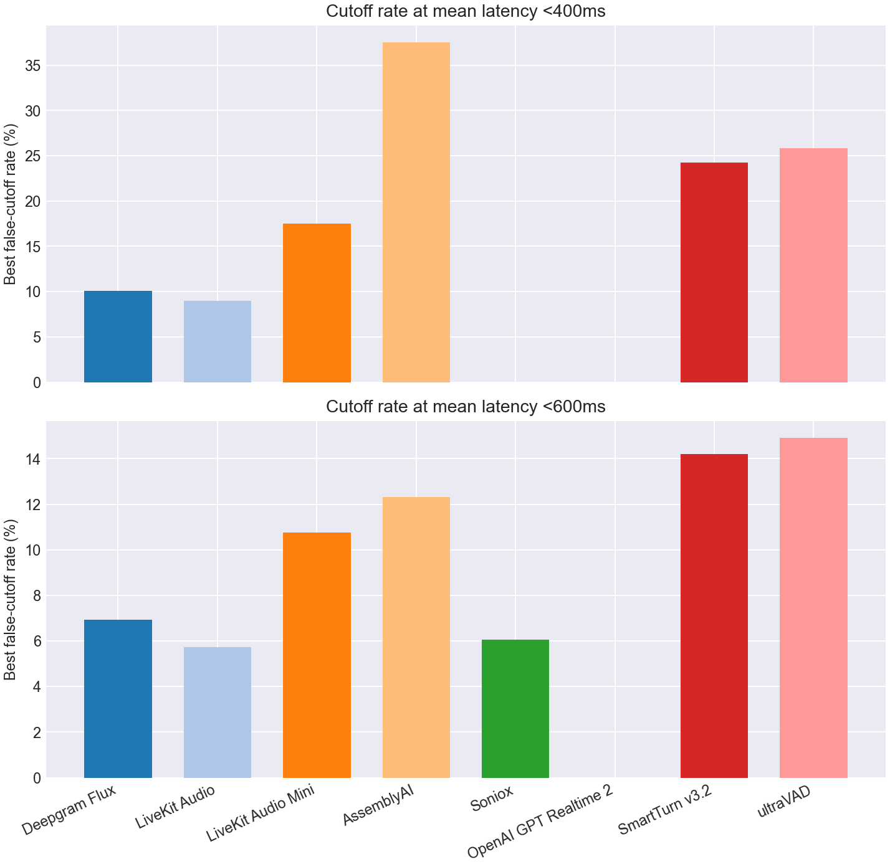

# EoT Model Comparison

## Classification Metrics Bar Charts

## Classification Metrics Table

| Model | Score Summary | Spans | AUC | AP | Mean Frontier Latency 0-10% |
| --- | --- | --- | --- | --- | --- |
| Deepgram Flux | max | 977 | 0.947 | 0.894 | 0.946 |
| LiveKit Turn Detector v1 | 0.200 | 977 | 0.944 | 0.910 | 0.765 |
| LiveKit Turn Detector v1-mini | 0.200 | 977 | 0.873 | 0.809 | 1.060 |
| AssemblyAI | max | 967 | 0.865 | 0.814 | 1.112 |
| Soniox | max | 977 | 0.864 | 0.798 | 0.981 |
| OpenAI GPT Realtime 2 | max | 977 | 0.863 | 0.762 | 1.230 |
| SmartTurn v3.2 | 0.200 | 977 | 0.810 | 0.734 | 1.173 |
| ultraVAD | 0.200 | 977 | 0.807 | 0.703 | 1.047 |

## Pareto Curve

## Cutoff Budgets 5%, 15%

## Latency Budgets 400ms, 600ms

## Operating Points

| Type | Budget | Model | Mean Latency | Cutoff | Detect | Threshold | Action Delay | Timeout |
| --- | --- | --- | --- | --- | --- | --- | --- | --- |
| Cutoff | 5.0% | Deepgram Flux | 0.826 | 4.9% | 98.0% | 0.500 | 0.800 | 2.000 |
| Cutoff | 5.0% | LiveKit Turn Detector v1 | 0.672 | 4.9% | 75.2% | 0.820 | 0.400 | 1.500 |
| Cutoff | 5.0% | LiveKit Turn Detector v1-mini | 0.947 | 4.9% | 79.0% | 0.330 | 0.800 | 1.500 |
| Cutoff | 5.0% | AssemblyAI | 0.907 | 4.9% | 85.0% | 0.620 | 0.800 | 1.500 |
| Cutoff | 5.0% | Soniox | 0.768 | 4.3% | 77.5% | 0.990 | 0.400 | 2.000 |
| Cutoff | 5.0% | OpenAI GPT Realtime 2 | 0.982 | 4.5% | 85.5% | 0.990 | 0.800 | 2.000 |
| Cutoff | 5.0% | SmartTurn v3.2 | 0.963 | 4.9% | 76.8% | 0.500 | 0.800 | 1.500 |
| Cutoff | 5.0% | ultraVAD | 0.864 | 4.7% | 96.2% | 0.080 | 0.800 | 2.500 |
| Cutoff | 15.0% | Deepgram Flux | 0.281 | 14.9% | 98.2% | 0.470 | 0.200 | 2.000 |
| Cutoff | 15.0% | LiveKit Turn Detector v1 | 0.250 | 14.9% | 93.8% | 0.500 | 0.200 | 1.000 |
| Cutoff | 15.0% | LiveKit Turn Detector v1-mini | 0.458 | 14.6% | 67.8% | 0.410 | 0.200 | 1.000 |
| Cutoff | 15.0% | AssemblyAI | 0.536 | 15.0% | 85.0% | 0.620 | 0.400 | 1.000 |
| Cutoff | 15.0% | Soniox | 0.463 | 8.8% | 77.5% | 0.990 | 0.200 | 1.000 |
| Cutoff | 15.0% | OpenAI GPT Realtime 2 | 0.655 | 11.1% | 85.0% | 0.990 | 0.200 | 1.000 |
| Cutoff | 15.0% | SmartTurn v3.2 | 0.589 | 14.4% | 58.8% | 0.930 | 0.300 | 1.000 |
| Cutoff | 15.0% | ultraVAD | 0.585 | 14.9% | 83.0% | 0.220 | 0.500 | 1.000 |
| Latency | 400ms | Deepgram Flux | 0.389 | 10.1% | 96.2% | 0.690 | 0.200 | 1.500 |
| Latency | 400ms | LiveKit Turn Detector v1 | 0.376 | 9.0% | 86.5% | 0.700 | 0.200 | 1.500 |
| Latency | 400ms | LiveKit Turn Detector v1-mini | 0.398 | 17.5% | 75.2% | 0.360 | 0.200 | 1.000 |
| Latency | 400ms | AssemblyAI | 0.382 | 37.5% | 95.2% | 0.000 | 0.300 | 1.500 |
| Latency | 400ms | Soniox | - | - | - | - | - | - |
| Latency | 400ms | OpenAI GPT Realtime 2 | - | - | - | - | - | - |
| Latency | 400ms | SmartTurn v3.2 | 0.398 | 24.3% | 75.2% | 0.560 | 0.200 | 1.000 |
| Latency | 400ms | ultraVAD | 0.398 | 25.8% | 86.0% | 0.190 | 0.300 | 1.000 |
| Latency | 600ms | Deepgram Flux | 0.596 | 6.9% | 96.2% | 0.690 | 0.500 | 2.000 |
| Latency | 600ms | LiveKit Turn Detector v1 | 0.597 | 5.7% | 75.2% | 0.820 | 0.300 | 1.500 |
| Latency | 600ms | LiveKit Turn Detector v1-mini | 0.594 | 10.7% | 67.8% | 0.410 | 0.400 | 1.000 |
| Latency | 600ms | AssemblyAI | 0.595 | 12.3% | 73.4% | 0.820 | 0.400 | 1.000 |
| Latency | 600ms | Soniox | 0.576 | 6.1% | 77.5% | 0.990 | 0.200 | 1.500 |
| Latency | 600ms | OpenAI GPT Realtime 2 | - | - | - | - | - | - |
| Latency | 600ms | SmartTurn v3.2 | 0.592 | 14.2% | 58.2% | 0.940 | 0.300 | 1.000 |
| Latency | 600ms | ultraVAD | 0.585 | 14.9% | 83.0% | 0.220 | 0.500 | 1.000 |
