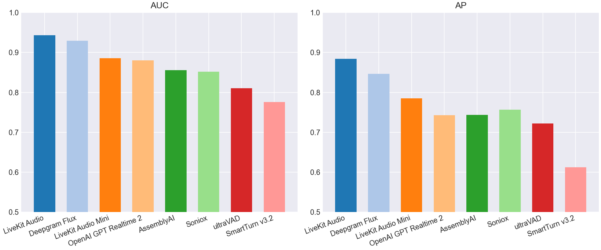
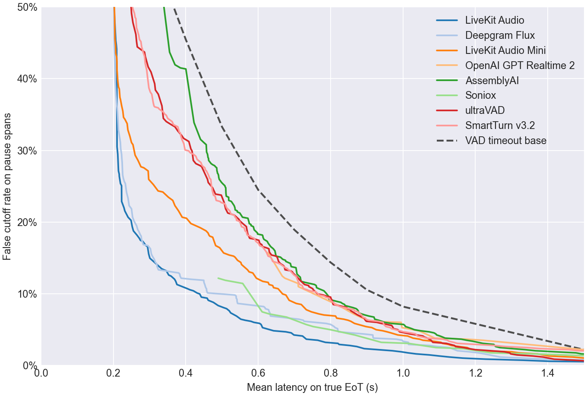
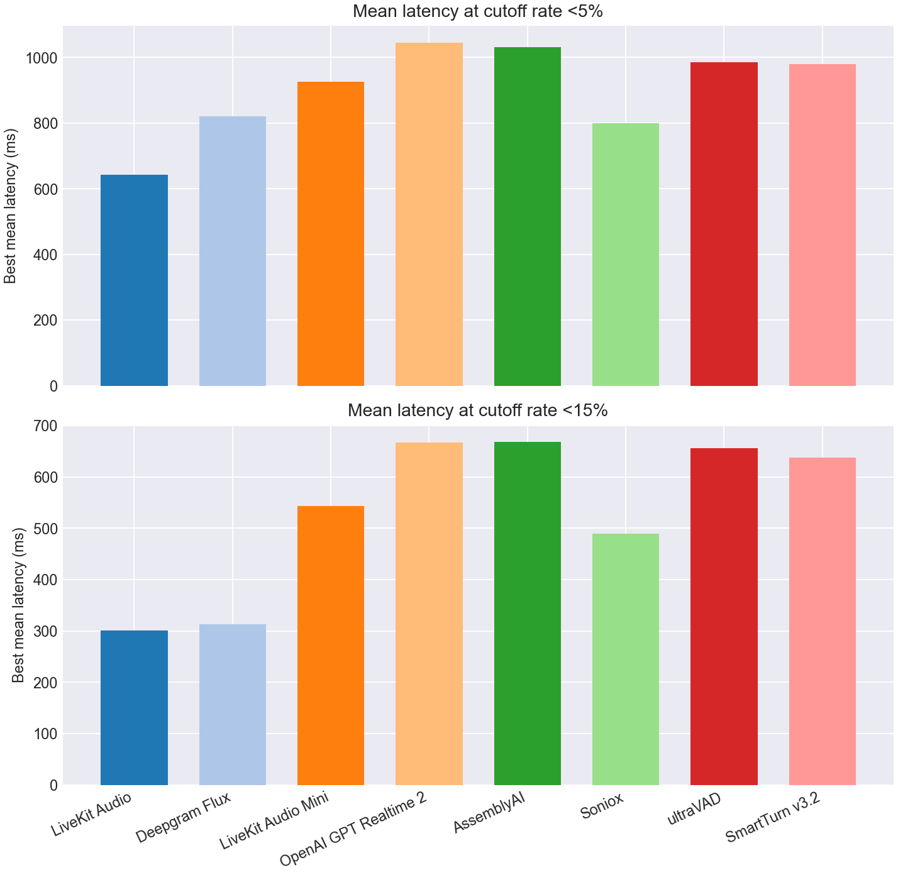
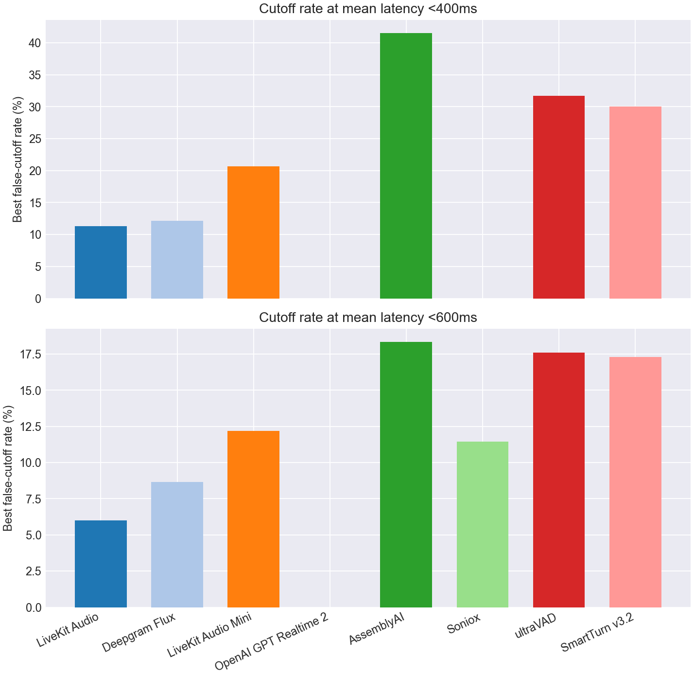

# EoT Model Comparison

## Classification Metrics Bar Charts

## Classification Metrics Table

| Model | Score Summary | Spans | AUC | AP | Mean Frontier Latency 0-10% |
| --- | --- | --- | --- | --- | --- |
| LiveKit Turn Detector v1 | 0.200 | 1082 | 0.943 | 0.884 | 0.810 |
| Deepgram Flux | max | 1082 | 0.930 | 0.847 | 0.973 |
| LiveKit Turn Detector v1-mini | 0.200 | 1082 | 0.885 | 0.785 | 1.079 |
| OpenAI GPT Realtime 2 | max | 1082 | 0.880 | 0.743 | 1.294 |
| AssemblyAI | max | 1082 | 0.856 | 0.744 | 1.182 |
| Soniox | max | 1082 | 0.852 | 0.757 | 1.060 |
| ultraVAD | 0.200 | 1082 | 0.810 | 0.722 | 1.081 |
| SmartTurn v3.2 | 0.200 | 1082 | 0.776 | 0.612 | 1.212 |

## Pareto Curve

## Cutoff Budgets 5%, 15%

## Latency Budgets 400ms, 600ms

## Operating Points

| Type | Budget | Model | Mean Latency | Cutoff | Detect | Threshold | Action Delay | Timeout |
| --- | --- | --- | --- | --- | --- | --- | --- | --- |
| Cutoff | 5.0% | LiveKit Turn Detector v1 | 0.642 | 4.8% | 90.5% | 0.610 | 0.500 | 2.000 |
| Cutoff | 5.0% | Deepgram Flux | 0.820 | 4.8% | 98.5% | 0.660 | 0.800 | 2.000 |
| Cutoff | 5.0% | LiveKit Turn Detector v1-mini | 0.926 | 5.0% | 89.5% | 0.360 | 0.800 | 2.000 |
| Cutoff | 5.0% | OpenAI GPT Realtime 2 | 1.044 | 4.8% | 91.2% | 0.990 | 1.000 | 1.500 |
| Cutoff | 5.0% | AssemblyAI | 1.031 | 5.0% | 89.2% | 0.300 | 0.900 | 2.000 |
| Cutoff | 5.0% | Soniox | 0.800 | 5.0% | 75.8% | 0.990 | 0.400 | 2.000 |
| Cutoff | 5.0% | ultraVAD | 0.986 | 5.0% | 84.5% | 0.210 | 0.800 | 2.000 |
| Cutoff | 5.0% | SmartTurn v3.2 | 0.980 | 5.0% | 85.0% | 0.770 | 0.800 | 2.000 |
| Cutoff | 15.0% | LiveKit Turn Detector v1 | 0.301 | 15.0% | 92.2% | 0.560 | 0.200 | 1.500 |
| Cutoff | 15.0% | Deepgram Flux | 0.313 | 14.8% | 98.5% | 0.650 | 0.200 | 2.000 |
| Cutoff | 15.0% | LiveKit Turn Detector v1-mini | 0.543 | 14.7% | 87.0% | 0.380 | 0.400 | 1.500 |
| Cutoff | 15.0% | OpenAI GPT Realtime 2 | 0.667 | 12.5% | 91.2% | 0.990 | 0.200 | 1.500 |
| Cutoff | 15.0% | AssemblyAI | 0.668 | 14.8% | 88.0% | 0.100 | 0.600 | 1.000 |
| Cutoff | 15.0% | Soniox | 0.490 | 12.2% | 75.8% | 0.990 | 0.200 | 1.000 |
| Cutoff | 15.0% | ultraVAD | 0.656 | 14.5% | 93.8% | 0.090 | 0.600 | 1.500 |
| Cutoff | 15.0% | SmartTurn v3.2 | 0.637 | 14.8% | 86.2% | 0.720 | 0.500 | 1.500 |
| Latency | 400ms | LiveKit Turn Detector v1 | 0.376 | 11.3% | 86.5% | 0.720 | 0.200 | 1.500 |
| Latency | 400ms | Deepgram Flux | 0.387 | 12.2% | 98.5% | 0.700 | 0.300 | 2.000 |
| Latency | 400ms | LiveKit Turn Detector v1-mini | 0.390 | 20.7% | 76.2% | 0.470 | 0.200 | 1.000 |
| Latency | 400ms | OpenAI GPT Realtime 2 | - | - | - | - | - | - |
| Latency | 400ms | AssemblyAI | 0.385 | 41.5% | 97.0% | 0.000 | 0.300 | 2.000 |
| Latency | 400ms | Soniox | - | - | - | - | - | - |
| Latency | 400ms | ultraVAD | 0.394 | 31.7% | 75.8% | 0.300 | 0.200 | 1.000 |
| Latency | 400ms | SmartTurn v3.2 | 0.398 | 30.1% | 86.0% | 0.740 | 0.300 | 1.000 |
| Latency | 600ms | LiveKit Turn Detector v1 | 0.588 | 6.0% | 88.2% | 0.670 | 0.400 | 2.000 |
| Latency | 600ms | Deepgram Flux | 0.543 | 8.7% | 98.5% | 0.700 | 0.500 | 2.000 |
| Latency | 600ms | LiveKit Turn Detector v1-mini | 0.595 | 12.2% | 90.5% | 0.350 | 0.500 | 1.500 |
| Latency | 600ms | OpenAI GPT Realtime 2 | - | - | - | - | - | - |
| Latency | 600ms | AssemblyAI | 0.598 | 18.3% | 88.0% | 0.100 | 0.500 | 1.000 |
| Latency | 600ms | Soniox | 0.557 | 11.4% | 75.8% | 0.990 | 0.400 | 1.000 |
| Latency | 600ms | ultraVAD | 0.592 | 17.6% | 58.2% | 0.460 | 0.300 | 1.000 |
| Latency | 600ms | SmartTurn v3.2 | 0.594 | 17.3% | 81.2% | 0.870 | 0.500 | 1.000 |
