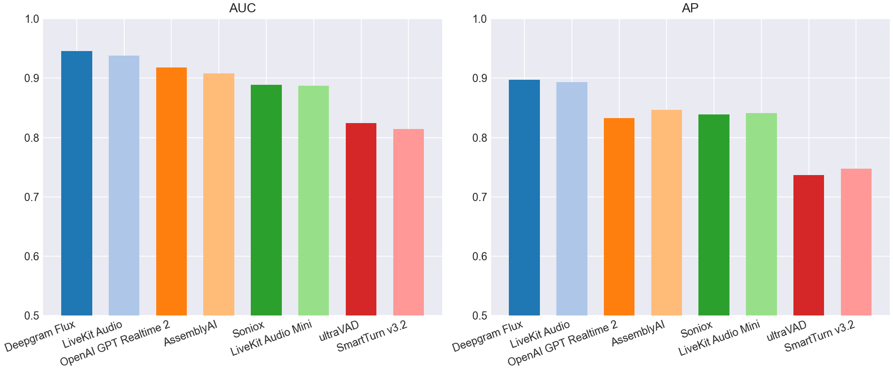
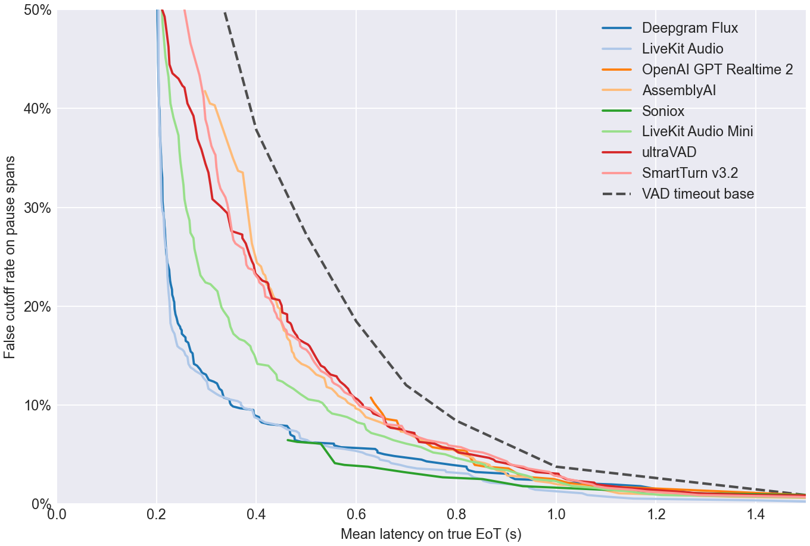
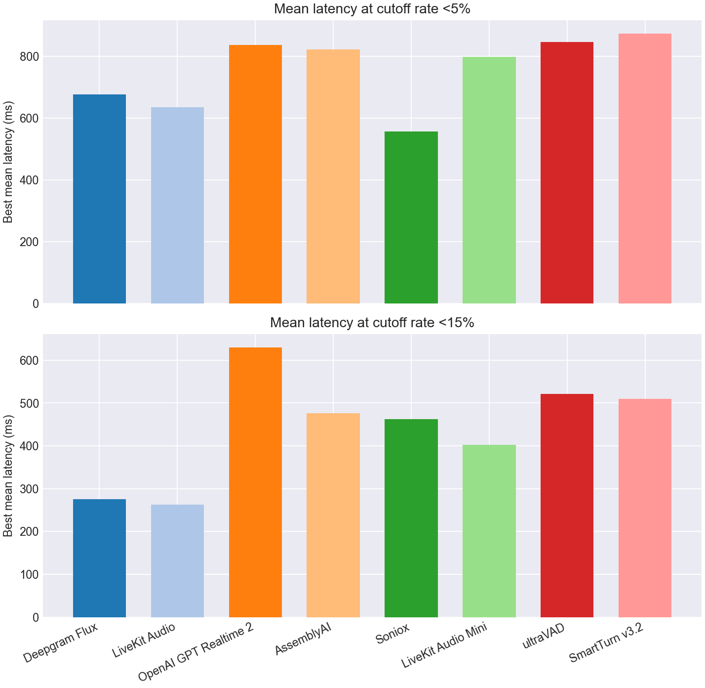
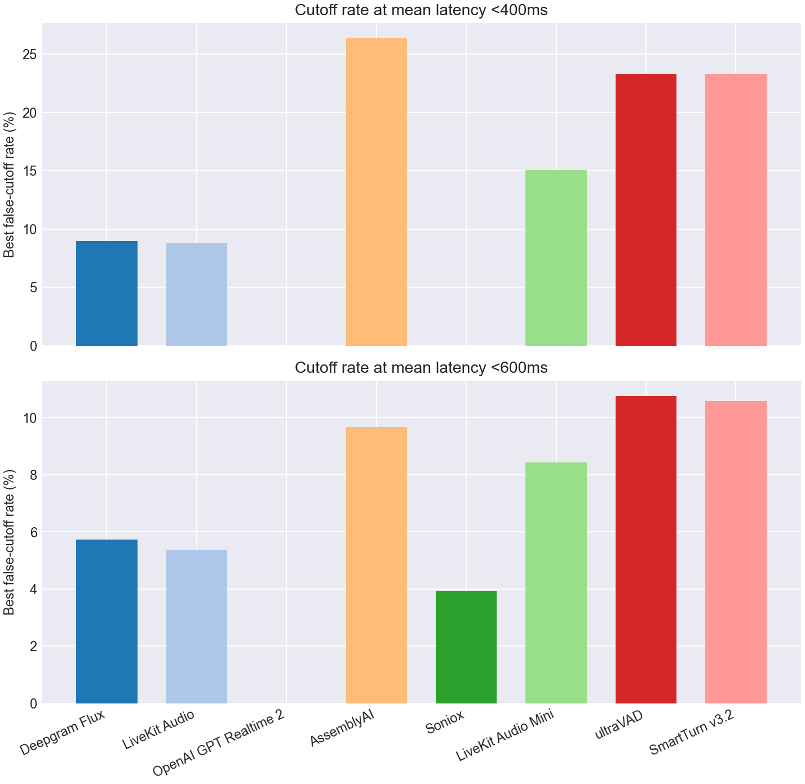

# EoT Model Comparison

## Classification Metrics Bar Charts

## Classification Metrics Table

| Model | Score Summary | Spans | AUC | AP | Mean Frontier Latency 0-10% |
| --- | --- | --- | --- | --- | --- |
| Deepgram Flux | max | 958 | 0.946 | 0.897 | 0.835 |
| LiveKit Turn Detector v1 | 0.200 | 958 | 0.938 | 0.894 | 0.727 |
| OpenAI GPT Realtime 2 | max | 958 | 0.918 | 0.833 | 1.017 |
| AssemblyAI | max | 958 | 0.908 | 0.846 | 0.935 |
| Soniox | max | 958 | 0.888 | 0.839 | 0.814 |
| LiveKit Turn Detector v1-mini | 0.200 | 958 | 0.887 | 0.842 | 0.879 |
| ultraVAD | 0.200 | 958 | 0.824 | 0.737 | 0.978 |
| SmartTurn v3.2 | 0.200 | 958 | 0.814 | 0.747 | 0.944 |

## Pareto Curve

## Cutoff Budgets 5%, 15%

## Latency Budgets 400ms, 600ms

## Operating Points

| Type | Budget | Model | Mean Latency | Cutoff | Detect | Threshold | Action Delay | Timeout |
| --- | --- | --- | --- | --- | --- | --- | --- | --- |
| Cutoff | 5.0% | Deepgram Flux | 0.676 | 4.8% | 78.0% | 0.730 | 0.400 | 1.500 |
| Cutoff | 5.0% | LiveKit Turn Detector v1 | 0.635 | 4.8% | 86.5% | 0.700 | 0.500 | 1.500 |
| Cutoff | 5.0% | OpenAI GPT Realtime 2 | 0.837 | 3.9% | 95.5% | 0.990 | 0.800 | 1.500 |
| Cutoff | 5.0% | AssemblyAI | 0.822 | 4.8% | 87.2% | 0.630 | 0.700 | 1.500 |
| Cutoff | 5.0% | Soniox | 0.557 | 4.1% | 81.2% | 0.990 | 0.200 | 1.500 |
| Cutoff | 5.0% | LiveKit Turn Detector v1-mini | 0.798 | 4.7% | 78.0% | 0.380 | 0.600 | 1.500 |
| Cutoff | 5.0% | ultraVAD | 0.846 | 4.8% | 51.2% | 0.450 | 0.700 | 1.000 |
| Cutoff | 5.0% | SmartTurn v3.2 | 0.873 | 4.8% | 63.5% | 0.870 | 0.800 | 1.000 |
| Cutoff | 15.0% | Deepgram Flux | 0.275 | 14.2% | 98.8% | 0.530 | 0.200 | 1.500 |
| Cutoff | 15.0% | LiveKit Turn Detector v1 | 0.262 | 14.9% | 92.2% | 0.530 | 0.200 | 1.000 |
| Cutoff | 15.0% | OpenAI GPT Realtime 2 | 0.629 | 10.8% | 95.2% | 0.990 | 0.200 | 1.000 |
| Cutoff | 15.0% | AssemblyAI | 0.476 | 14.9% | 87.5% | 0.500 | 0.200 | 1.000 |
| Cutoff | 15.0% | Soniox | 0.463 | 6.5% | 80.8% | 0.990 | 0.200 | 1.000 |
| Cutoff | 15.0% | LiveKit Turn Detector v1-mini | 0.402 | 14.2% | 74.8% | 0.420 | 0.200 | 1.000 |
| Cutoff | 15.0% | ultraVAD | 0.520 | 14.7% | 68.5% | 0.320 | 0.300 | 1.000 |
| Cutoff | 15.0% | SmartTurn v3.2 | 0.510 | 14.9% | 70.0% | 0.740 | 0.300 | 1.000 |
| Latency | 400ms | Deepgram Flux | 0.396 | 9.0% | 97.8% | 0.660 | 0.300 | 1.500 |
| Latency | 400ms | LiveKit Turn Detector v1 | 0.396 | 8.8% | 92.0% | 0.560 | 0.300 | 1.500 |
| Latency | 400ms | OpenAI GPT Realtime 2 | - | - | - | - | - | - |
| Latency | 400ms | AssemblyAI | 0.391 | 26.3% | 94.5% | 0.010 | 0.200 | 1.000 |
| Latency | 400ms | Soniox | - | - | - | - | - | - |
| Latency | 400ms | LiveKit Turn Detector v1-mini | 0.396 | 15.1% | 75.5% | 0.410 | 0.200 | 1.000 |
| Latency | 400ms | ultraVAD | 0.398 | 23.3% | 86.0% | 0.190 | 0.300 | 1.000 |
| Latency | 400ms | SmartTurn v3.2 | 0.396 | 23.3% | 75.5% | 0.520 | 0.200 | 1.000 |
| Latency | 600ms | Deepgram Flux | 0.570 | 5.7% | 97.2% | 0.690 | 0.500 | 2.000 |
| Latency | 600ms | LiveKit Turn Detector v1 | 0.598 | 5.4% | 90.2% | 0.630 | 0.500 | 1.500 |
| Latency | 600ms | OpenAI GPT Realtime 2 | - | - | - | - | - | - |
| Latency | 600ms | AssemblyAI | 0.598 | 9.7% | 77.0% | 0.750 | 0.400 | 1.000 |
| Latency | 600ms | Soniox | 0.576 | 3.9% | 81.2% | 0.990 | 0.300 | 1.500 |
| Latency | 600ms | LiveKit Turn Detector v1-mini | 0.597 | 8.4% | 67.2% | 0.470 | 0.400 | 1.000 |
| Latency | 600ms | ultraVAD | 0.597 | 10.8% | 67.2% | 0.330 | 0.400 | 1.000 |
| Latency | 600ms | SmartTurn v3.2 | 0.596 | 10.6% | 57.8% | 0.920 | 0.300 | 1.000 |
