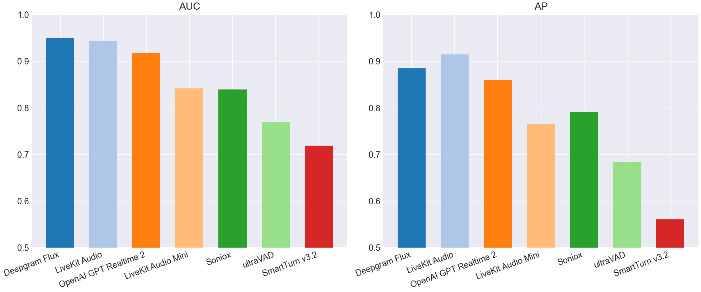
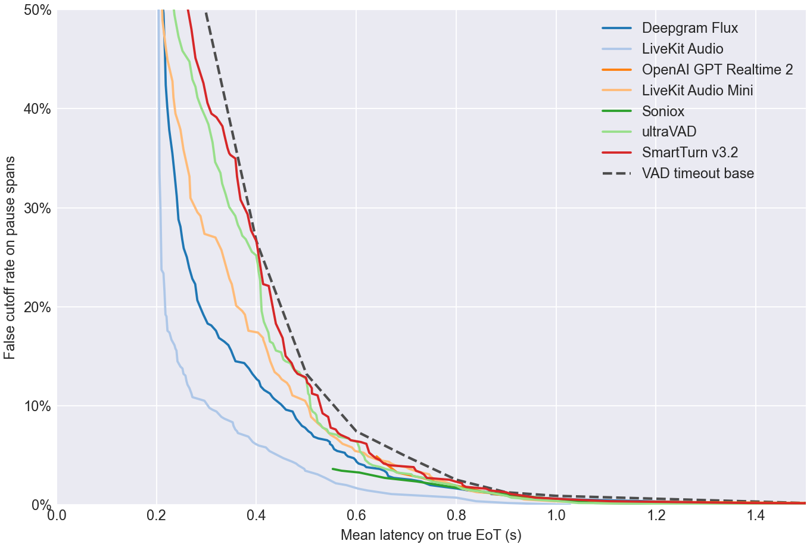
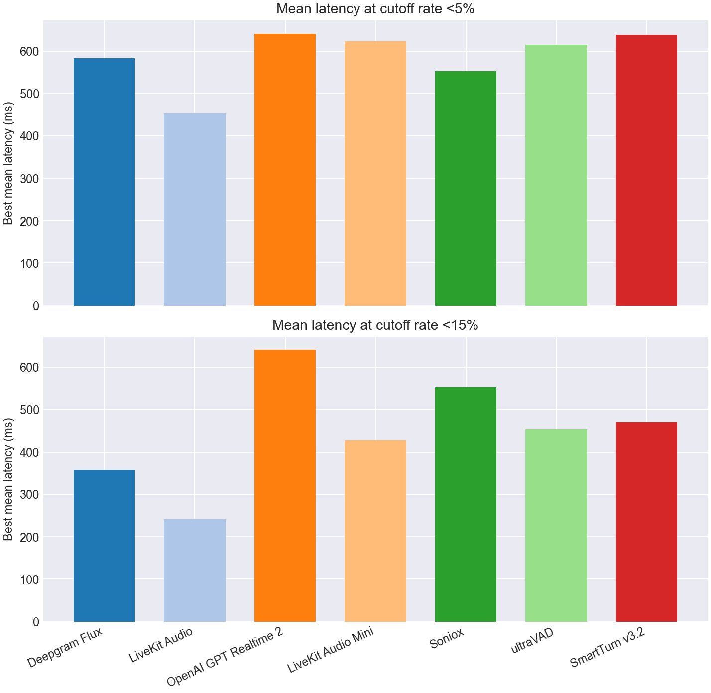
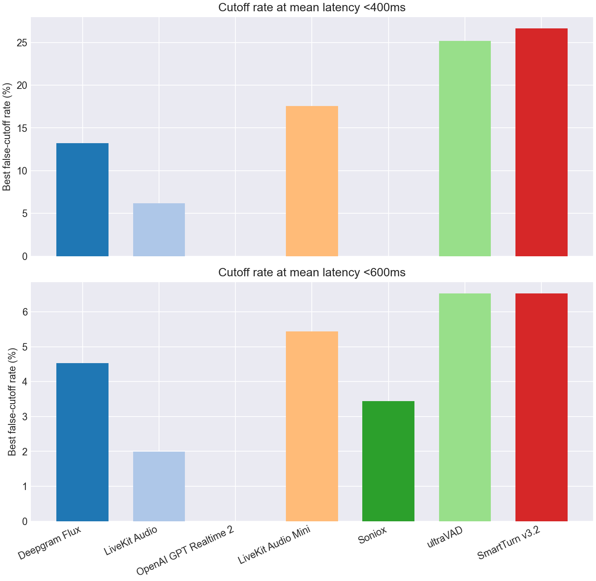

# EoT Model Comparison

## Classification Metrics Bar Charts

## Classification Metrics Table

| Model | Score Summary | Spans | AUC | AP | Mean Frontier Latency 0-10% |
| --- | --- | --- | --- | --- | --- |
| Deepgram Flux | max | 952 | 0.950 | 0.885 | 0.673 |
| LiveKit Turn Detector v1 | 0.200 | 952 | 0.944 | 0.915 | 0.491 |
| OpenAI GPT Realtime 2 | max | 952 | 0.917 | 0.860 | 0.759 |
| LiveKit Turn Detector v1-mini | 0.200 | 952 | 0.842 | 0.765 | 0.682 |
| Soniox | max | 952 | 0.840 | 0.791 | 0.662 |
| ultraVAD | 0.200 | 952 | 0.770 | 0.684 | 0.678 |
| SmartTurn v3.2 | 0.200 | 952 | 0.719 | 0.561 | 0.725 |

## Pareto Curve

## Cutoff Budgets 5%, 15%

## Latency Budgets 400ms, 600ms

## Operating Points

| Type | Budget | Model | Mean Latency | Cutoff | Detect | Threshold | Action Delay | Timeout |
| --- | --- | --- | --- | --- | --- | --- | --- | --- |
| Cutoff | 5.0% | Deepgram Flux | 0.583 | 4.9% | 87.5% | 0.610 | 0.400 | 1.000 |
| Cutoff | 5.0% | LiveKit Turn Detector v1 | 0.454 | 4.7% | 68.2% | 0.880 | 0.200 | 1.000 |
| Cutoff | 5.0% | OpenAI GPT Realtime 2 | 0.641 | 4.9% | 89.8% | 0.990 | 0.200 | 1.000 |
| Cutoff | 5.0% | LiveKit Turn Detector v1-mini | 0.624 | 4.9% | 75.2% | 0.360 | 0.500 | 1.000 |
| Cutoff | 5.0% | Soniox | 0.553 | 3.6% | 70.5% | 0.990 | 0.200 | 1.000 |
| Cutoff | 5.0% | ultraVAD | 0.616 | 4.9% | 98.2% | 0.060 | 0.600 | 1.500 |
| Cutoff | 5.0% | SmartTurn v3.2 | 0.639 | 4.7% | 90.2% | 0.040 | 0.600 | 1.000 |
| Cutoff | 15.0% | Deepgram Flux | 0.358 | 14.5% | 96.0% | 0.330 | 0.200 | 1.000 |
| Cutoff | 15.0% | LiveKit Turn Detector v1 | 0.242 | 14.5% | 94.8% | 0.500 | 0.200 | 1.000 |
| Cutoff | 15.0% | OpenAI GPT Realtime 2 | 0.641 | 4.9% | 89.8% | 0.990 | 0.200 | 1.000 |
| Cutoff | 15.0% | LiveKit Turn Detector v1-mini | 0.428 | 14.5% | 81.8% | 0.310 | 0.300 | 1.000 |
| Cutoff | 15.0% | Soniox | 0.553 | 3.6% | 70.5% | 0.990 | 0.200 | 1.000 |
| Cutoff | 15.0% | ultraVAD | 0.454 | 14.7% | 91.0% | 0.130 | 0.400 | 1.000 |
| Cutoff | 15.0% | SmartTurn v3.2 | 0.471 | 14.3% | 88.2% | 0.050 | 0.400 | 1.000 |
| Latency | 400ms | Deepgram Flux | 0.392 | 13.2% | 95.2% | 0.370 | 0.200 | 1.000 |
| Latency | 400ms | LiveKit Turn Detector v1 | 0.398 | 6.2% | 86.0% | 0.730 | 0.300 | 1.000 |
| Latency | 400ms | OpenAI GPT Realtime 2 | - | - | - | - | - | - |
| Latency | 400ms | LiveKit Turn Detector v1-mini | 0.384 | 17.6% | 88.0% | 0.270 | 0.300 | 1.000 |
| Latency | 400ms | Soniox | - | - | - | - | - | - |
| Latency | 400ms | ultraVAD | 0.400 | 25.2% | 85.8% | 0.190 | 0.300 | 1.000 |
| Latency | 400ms | SmartTurn v3.2 | 0.400 | 26.6% | 100.0% | 0.000 | 0.400 | 1.000 |
| Latency | 600ms | Deepgram Flux | 0.598 | 4.5% | 89.5% | 0.550 | 0.500 | 1.000 |
| Latency | 600ms | LiveKit Turn Detector v1 | 0.580 | 2.0% | 70.0% | 0.870 | 0.400 | 1.000 |
| Latency | 600ms | OpenAI GPT Realtime 2 | - | - | - | - | - | - |
| Latency | 600ms | LiveKit Turn Detector v1-mini | 0.598 | 5.4% | 80.5% | 0.320 | 0.500 | 1.000 |
| Latency | 600ms | Soniox | 0.570 | 3.4% | 70.5% | 0.990 | 0.300 | 1.000 |
| Latency | 600ms | ultraVAD | 0.590 | 6.5% | 91.0% | 0.130 | 0.500 | 1.500 |
| Latency | 600ms | SmartTurn v3.2 | 0.589 | 6.5% | 82.2% | 0.110 | 0.500 | 1.000 |
