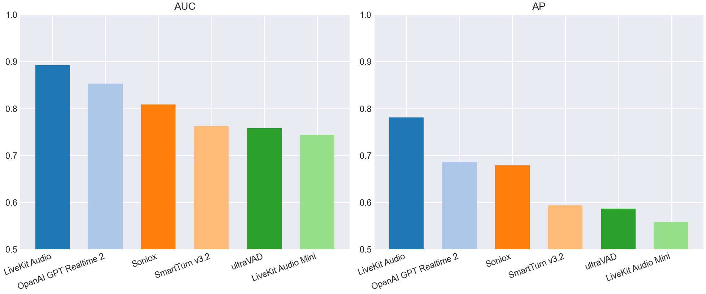
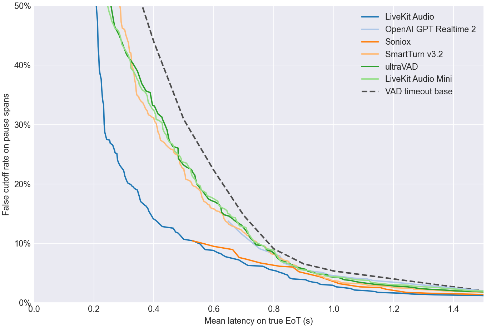
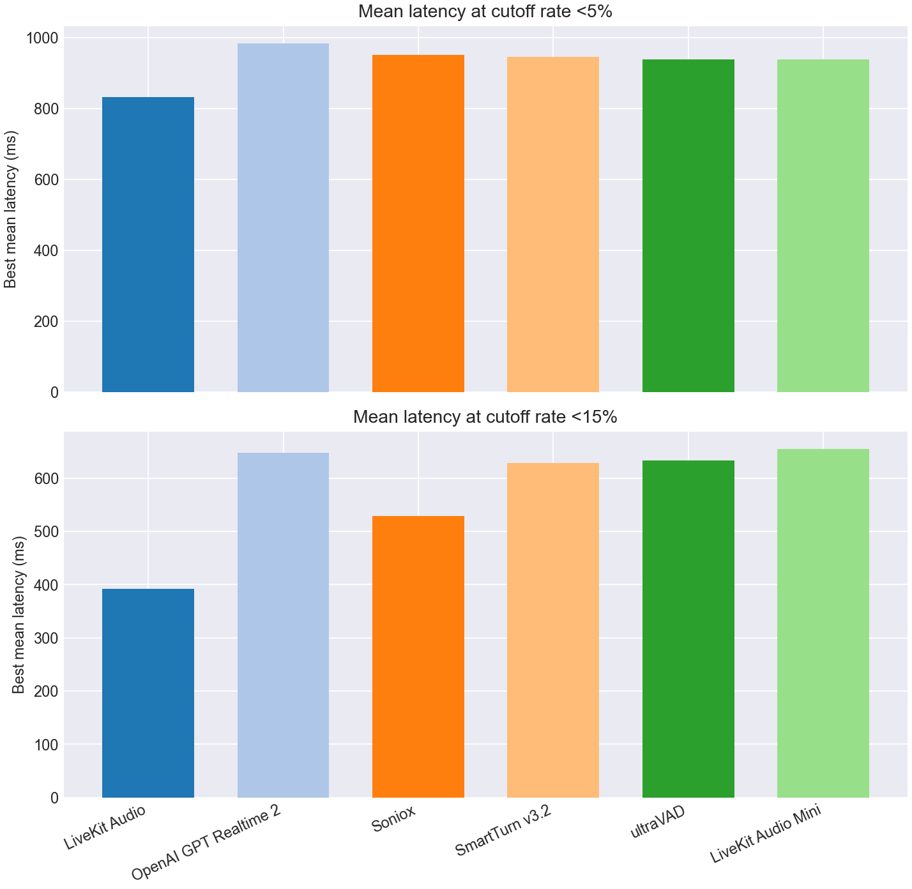
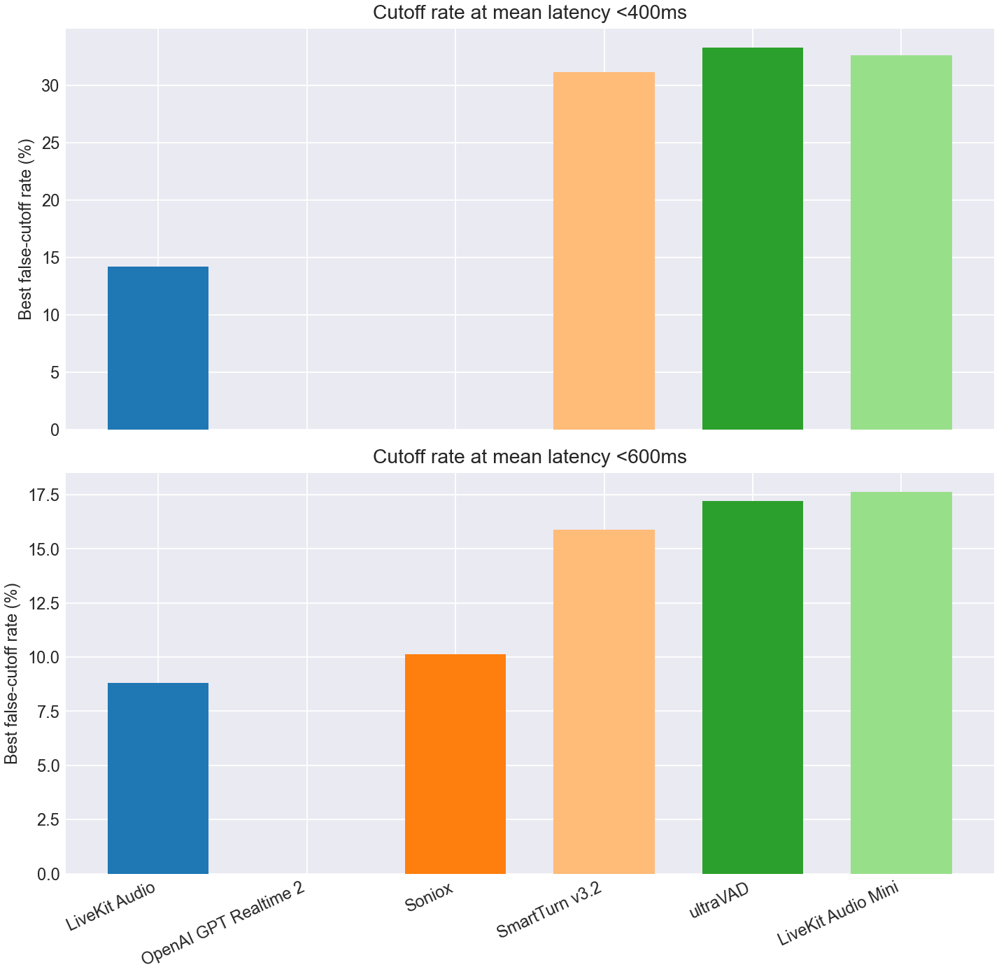

# EoT Model Comparison

## Classification Metrics Bar Charts

## Classification Metrics Table

| Model | Score Summary | Spans | AUC | AP | Mean Frontier Latency 0-10% |
| --- | --- | --- | --- | --- | --- |
| LiveKit Turn Detector v1 | 0.200 | 1145 | 0.893 | 0.781 | 0.953 |
| OpenAI GPT Realtime 2 | max | 1145 | 0.853 | 0.687 | 1.228 |
| Soniox | max | 1145 | 0.809 | 0.679 | 1.080 |
| SmartTurn v3.2 | 0.200 | 1145 | 0.763 | 0.594 | 1.124 |
| ultraVAD | 0.200 | 1145 | 0.758 | 0.587 | 1.127 |
| LiveKit Turn Detector v1-mini | 0.200 | 1145 | 0.744 | 0.559 | 1.147 |

## Pareto Curve

## Cutoff Budgets 5%, 15%

## Latency Budgets 400ms, 600ms

## Operating Points

| Type | Budget | Model | Mean Latency | Cutoff | Detect | Threshold | Action Delay | Timeout |
| --- | --- | --- | --- | --- | --- | --- | --- | --- |
| Cutoff | 5.0% | LiveKit Turn Detector v1 | 0.832 | 4.9% | 95.5% | 0.300 | 0.800 | 1.500 |
| Cutoff | 5.0% | OpenAI GPT Realtime 2 | 0.982 | 4.7% | 87.1% | 0.990 | 0.900 | 1.500 |
| Cutoff | 5.0% | Soniox | 0.952 | 4.4% | 68.9% | 0.990 | 0.700 | 1.500 |
| Cutoff | 5.0% | SmartTurn v3.2 | 0.945 | 4.7% | 92.4% | 0.050 | 0.900 | 1.500 |
| Cutoff | 5.0% | ultraVAD | 0.939 | 4.9% | 96.5% | 0.030 | 0.900 | 2.000 |
| Cutoff | 5.0% | LiveKit Turn Detector v1-mini | 0.938 | 4.9% | 93.7% | 0.260 | 0.900 | 1.500 |
| Cutoff | 15.0% | LiveKit Turn Detector v1 | 0.392 | 14.7% | 76.0% | 0.750 | 0.200 | 1.000 |
| Cutoff | 15.0% | OpenAI GPT Realtime 2 | 0.648 | 13.8% | 86.1% | 0.990 | 0.200 | 1.000 |
| Cutoff | 15.0% | Soniox | 0.529 | 10.4% | 68.7% | 0.990 | 0.200 | 1.000 |
| Cutoff | 15.0% | SmartTurn v3.2 | 0.629 | 15.0% | 74.2% | 0.750 | 0.500 | 1.000 |
| Cutoff | 15.0% | ultraVAD | 0.634 | 14.8% | 73.2% | 0.150 | 0.500 | 1.000 |
| Cutoff | 15.0% | LiveKit Turn Detector v1-mini | 0.655 | 14.8% | 86.4% | 0.340 | 0.600 | 1.000 |
| Latency | 400ms | LiveKit Turn Detector v1 | 0.398 | 14.2% | 75.3% | 0.760 | 0.200 | 1.000 |
| Latency | 400ms | OpenAI GPT Realtime 2 | - | - | - | - | - | - |
| Latency | 400ms | Soniox | - | - | - | - | - | - |
| Latency | 400ms | SmartTurn v3.2 | 0.400 | 31.1% | 75.0% | 0.720 | 0.200 | 1.000 |
| Latency | 400ms | ultraVAD | 0.395 | 33.2% | 86.4% | 0.080 | 0.300 | 1.000 |
| Latency | 400ms | LiveKit Turn Detector v1-mini | 0.395 | 32.6% | 86.4% | 0.340 | 0.300 | 1.000 |
| Latency | 600ms | LiveKit Turn Detector v1 | 0.598 | 8.8% | 66.9% | 0.810 | 0.400 | 1.000 |
| Latency | 600ms | OpenAI GPT Realtime 2 | - | - | - | - | - | - |
| Latency | 600ms | Soniox | 0.551 | 10.1% | 68.7% | 0.990 | 0.300 | 1.000 |
| Latency | 600ms | SmartTurn v3.2 | 0.593 | 15.9% | 81.3% | 0.520 | 0.500 | 1.000 |
| Latency | 600ms | ultraVAD | 0.591 | 17.2% | 81.8% | 0.100 | 0.500 | 1.000 |
| Latency | 600ms | LiveKit Turn Detector v1-mini | 0.596 | 17.6% | 80.8% | 0.400 | 0.500 | 1.000 |
