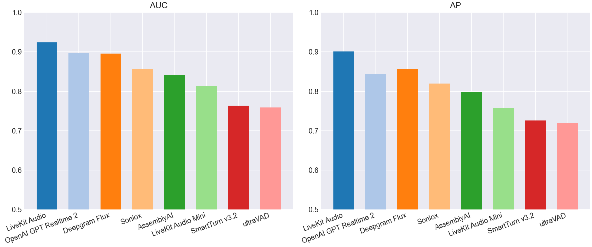
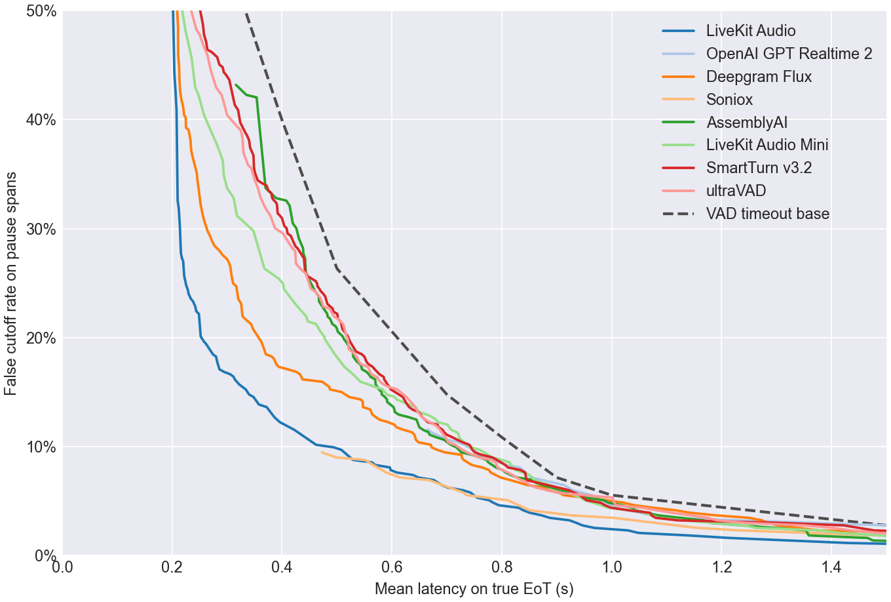
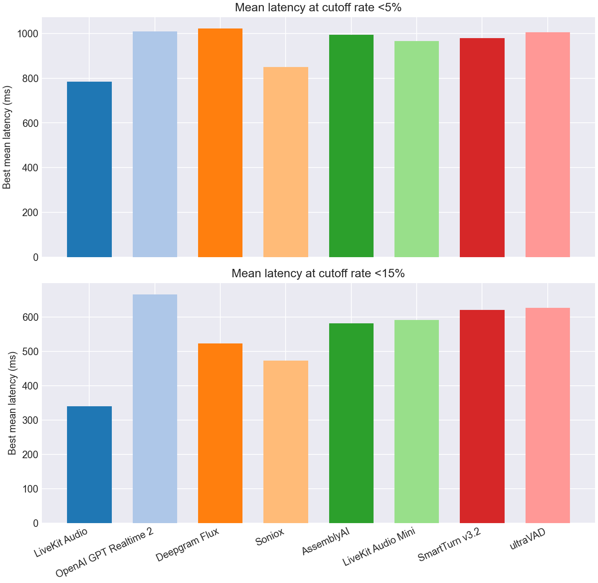
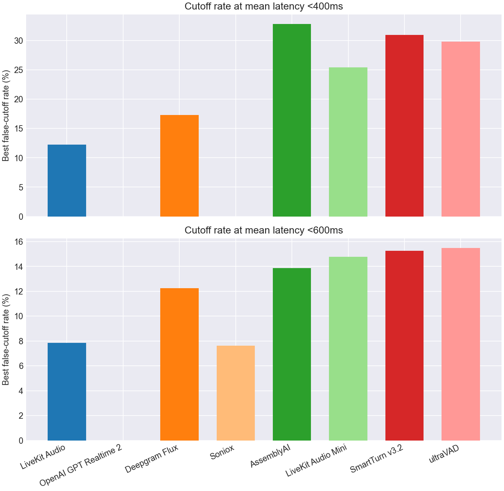

# EoT Model Comparison

## Classification Metrics Bar Charts

## Classification Metrics Table

| Model | Score Summary | Spans | AUC | AP | Mean Frontier Latency 0-10% |
| --- | --- | --- | --- | --- | --- |
| LiveKit Turn Detector v1 | 0.200 | 833 | 0.924 | 0.901 | 0.906 |
| OpenAI GPT Realtime 2 | max | 833 | 0.897 | 0.844 | 1.279 |
| Deepgram Flux | max | 833 | 0.896 | 0.857 | 1.132 |
| Soniox | max | 833 | 0.857 | 0.819 | 1.070 |
| AssemblyAI | max | 833 | 0.841 | 0.797 | 1.117 |
| LiveKit Turn Detector v1-mini | 0.200 | 833 | 0.813 | 0.757 | 1.136 |
| SmartTurn v3.2 | 0.200 | 833 | 0.763 | 0.726 | 1.207 |
| ultraVAD | 0.200 | 833 | 0.759 | 0.719 | 1.169 |

## Pareto Curve

## Cutoff Budgets 5%, 15%

## Latency Budgets 400ms, 600ms

## Operating Points

| Type | Budget | Model | Mean Latency | Cutoff | Detect | Threshold | Action Delay | Timeout |
| --- | --- | --- | --- | --- | --- | --- | --- | --- |
| Cutoff | 5.0% | LiveKit Turn Detector v1 | 0.784 | 4.8% | 93.5% | 0.640 | 0.700 | 2.000 |
| Cutoff | 5.0% | OpenAI GPT Realtime 2 | 1.009 | 4.4% | 90.8% | 0.990 | 0.900 | 2.000 |
| Cutoff | 5.0% | Deepgram Flux | 1.022 | 4.8% | 95.8% | 0.520 | 1.000 | 1.500 |
| Cutoff | 5.0% | Soniox | 0.851 | 4.2% | 77.0% | 0.990 | 0.500 | 2.000 |
| Cutoff | 5.0% | AssemblyAI | 0.994 | 4.8% | 91.8% | 0.020 | 0.900 | 2.000 |
| Cutoff | 5.0% | LiveKit Turn Detector v1-mini | 0.966 | 4.8% | 94.0% | 0.180 | 0.900 | 2.000 |
| Cutoff | 5.0% | SmartTurn v3.2 | 0.980 | 4.8% | 92.8% | 0.050 | 0.900 | 2.000 |
| Cutoff | 5.0% | ultraVAD | 1.005 | 4.8% | 99.5% | 0.010 | 1.000 | 2.000 |
| Cutoff | 15.0% | LiveKit Turn Detector v1 | 0.340 | 14.8% | 82.5% | 0.870 | 0.200 | 1.000 |
| Cutoff | 15.0% | OpenAI GPT Realtime 2 | 0.665 | 11.5% | 89.2% | 0.990 | 0.200 | 1.000 |
| Cutoff | 15.0% | Deepgram Flux | 0.522 | 14.5% | 71.0% | 0.730 | 0.200 | 1.000 |
| Cutoff | 15.0% | Soniox | 0.473 | 9.5% | 76.5% | 0.990 | 0.200 | 1.000 |
| Cutoff | 15.0% | AssemblyAI | 0.581 | 14.8% | 89.0% | 0.060 | 0.500 | 1.000 |
| Cutoff | 15.0% | LiveKit Turn Detector v1-mini | 0.591 | 14.8% | 58.5% | 0.390 | 0.300 | 1.000 |
| Cutoff | 15.0% | SmartTurn v3.2 | 0.620 | 14.5% | 76.0% | 0.680 | 0.500 | 1.000 |
| Cutoff | 15.0% | ultraVAD | 0.626 | 14.5% | 74.8% | 0.270 | 0.500 | 1.000 |
| Latency | 400ms | LiveKit Turn Detector v1 | 0.396 | 12.2% | 75.5% | 0.920 | 0.200 | 1.000 |
| Latency | 400ms | OpenAI GPT Realtime 2 | - | - | - | - | - | - |
| Latency | 400ms | Deepgram Flux | 0.394 | 17.3% | 91.5% | 0.690 | 0.200 | 1.000 |
| Latency | 400ms | Soniox | - | - | - | - | - | - |
| Latency | 400ms | AssemblyAI | 0.389 | 32.8% | 96.2% | 0.000 | 0.300 | 1.500 |
| Latency | 400ms | LiveKit Turn Detector v1-mini | 0.394 | 25.4% | 75.8% | 0.310 | 0.200 | 1.000 |
| Latency | 400ms | SmartTurn v3.2 | 0.400 | 30.9% | 75.0% | 0.710 | 0.200 | 1.000 |
| Latency | 400ms | ultraVAD | 0.394 | 29.8% | 86.5% | 0.180 | 0.300 | 1.000 |
| Latency | 600ms | LiveKit Turn Detector v1 | 0.598 | 7.9% | 93.5% | 0.640 | 0.500 | 2.000 |
| Latency | 600ms | OpenAI GPT Realtime 2 | - | - | - | - | - | - |
| Latency | 600ms | Deepgram Flux | 0.593 | 12.2% | 94.5% | 0.640 | 0.500 | 1.500 |
| Latency | 600ms | Soniox | 0.589 | 7.6% | 76.8% | 0.990 | 0.200 | 1.500 |
| Latency | 600ms | AssemblyAI | 0.597 | 13.9% | 86.2% | 0.220 | 0.500 | 1.000 |
| Latency | 600ms | LiveKit Turn Detector v1-mini | 0.591 | 14.8% | 58.5% | 0.390 | 0.300 | 1.000 |
| Latency | 600ms | SmartTurn v3.2 | 0.598 | 15.2% | 67.0% | 0.890 | 0.400 | 1.000 |
| Latency | 600ms | ultraVAD | 0.594 | 15.5% | 81.2% | 0.220 | 0.500 | 1.000 |
