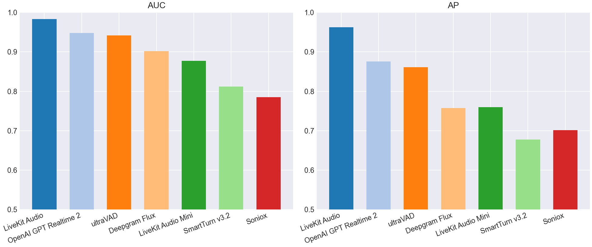
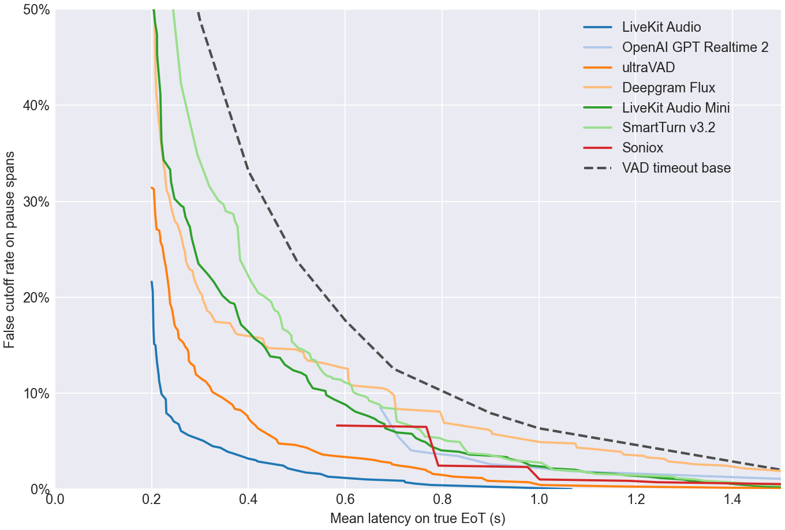
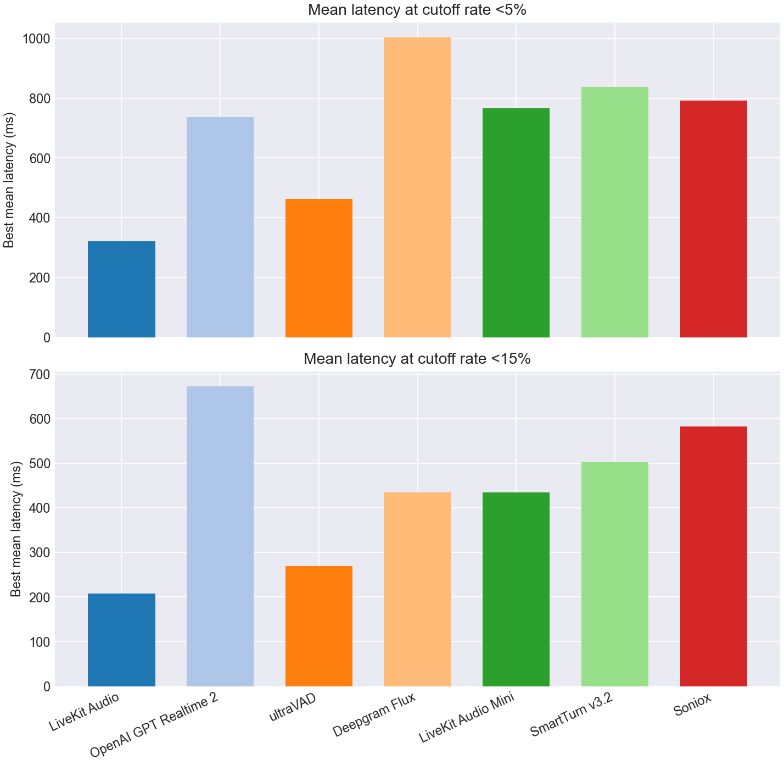
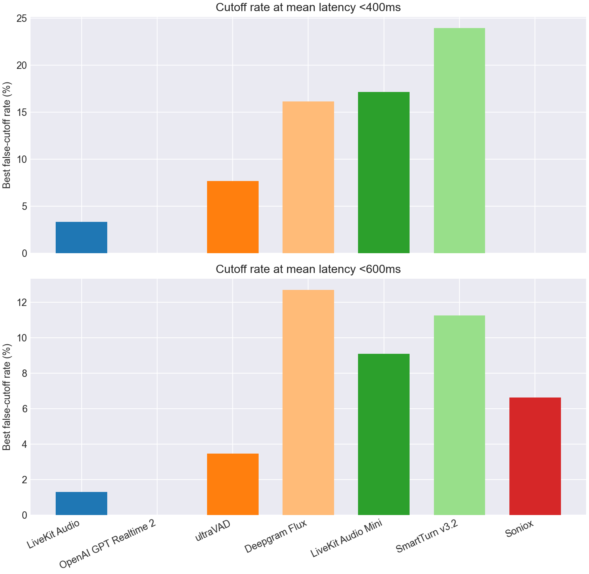

# EoT Model Comparison

## Classification Metrics Bar Charts

## Classification Metrics Table

| Model | Score Summary | Spans | AUC | AP | Mean Frontier Latency 0-10% |
| --- | --- | --- | --- | --- | --- |
| LiveKit Turn Detector v1 | 0.200 | 1050 | 0.983 | 0.963 | 0.389 |
| OpenAI GPT Realtime 2 | max | 1050 | 0.948 | 0.876 | 1.016 |
| ultraVAD | 0.200 | 1050 | 0.942 | 0.861 | 0.597 |
| Deepgram Flux | max | 1050 | 0.902 | 0.757 | 1.150 |
| LiveKit Turn Detector v1-mini | 0.200 | 1050 | 0.877 | 0.760 | 0.894 |
| SmartTurn v3.2 | 0.200 | 1050 | 0.812 | 0.677 | 0.932 |
| Soniox | max | 1050 | 0.785 | 0.702 | 0.878 |

## Pareto Curve

## Cutoff Budgets 5%, 15%

## Latency Budgets 400ms, 600ms

## Operating Points

| Type | Budget | Model | Mean Latency | Cutoff | Detect | Threshold | Action Delay | Timeout |
| --- | --- | --- | --- | --- | --- | --- | --- | --- |
| Cutoff | 5.0% | LiveKit Turn Detector v1 | 0.321 | 4.6% | 93.3% | 0.590 | 0.200 | 2.000 |
| Cutoff | 5.0% | OpenAI GPT Realtime 2 | 0.736 | 4.0% | 94.7% | 0.990 | 0.200 | 2.000 |
| Cutoff | 5.0% | ultraVAD | 0.462 | 4.8% | 90.4% | 0.260 | 0.300 | 2.000 |
| Cutoff | 5.0% | Deepgram Flux | 1.003 | 4.9% | 99.7% | 0.670 | 1.000 | 2.000 |
| Cutoff | 5.0% | LiveKit Turn Detector v1-mini | 0.766 | 4.9% | 94.9% | 0.180 | 0.700 | 2.000 |
| Cutoff | 5.0% | SmartTurn v3.2 | 0.837 | 4.9% | 82.9% | 0.040 | 0.700 | 1.500 |
| Cutoff | 5.0% | Soniox | 0.792 | 2.4% | 58.1% | 0.990 | 0.200 | 1.500 |
| Cutoff | 15.0% | LiveKit Turn Detector v1 | 0.208 | 15.0% | 99.7% | 0.110 | 0.200 | 3.000 |
| Cutoff | 15.0% | OpenAI GPT Realtime 2 | 0.672 | 8.5% | 90.2% | 0.990 | 0.200 | 1.000 |
| Cutoff | 15.0% | ultraVAD | 0.269 | 14.8% | 94.7% | 0.150 | 0.200 | 1.500 |
| Cutoff | 15.0% | Deepgram Flux | 0.434 | 15.0% | 99.7% | 0.670 | 0.400 | 2.000 |
| Cutoff | 15.0% | LiveKit Turn Detector v1-mini | 0.435 | 14.7% | 88.8% | 0.240 | 0.300 | 1.500 |
| Cutoff | 15.0% | SmartTurn v3.2 | 0.503 | 14.7% | 82.9% | 0.040 | 0.400 | 1.000 |
| Cutoff | 15.0% | Soniox | 0.583 | 6.6% | 58.1% | 0.990 | 0.200 | 1.000 |
| Latency | 400ms | LiveKit Turn Detector v1 | 0.392 | 3.3% | 89.3% | 0.700 | 0.200 | 2.000 |
| Latency | 400ms | OpenAI GPT Realtime 2 | - | - | - | - | - | - |
| Latency | 400ms | ultraVAD | 0.398 | 7.6% | 91.9% | 0.230 | 0.300 | 1.500 |
| Latency | 400ms | Deepgram Flux | 0.377 | 16.1% | 99.4% | 0.700 | 0.300 | 2.000 |
| Latency | 400ms | LiveKit Turn Detector v1-mini | 0.385 | 17.1% | 87.9% | 0.250 | 0.300 | 1.000 |
| Latency | 400ms | SmartTurn v3.2 | 0.383 | 23.9% | 88.2% | 0.020 | 0.300 | 1.000 |
| Latency | 400ms | Soniox | - | - | - | - | - | - |
| Latency | 600ms | LiveKit Turn Detector v1 | 0.564 | 1.3% | 79.8% | 0.860 | 0.200 | 2.000 |
| Latency | 600ms | OpenAI GPT Realtime 2 | - | - | - | - | - | - |
| Latency | 600ms | ultraVAD | 0.577 | 3.5% | 83.7% | 0.320 | 0.300 | 2.000 |
| Latency | 600ms | Deepgram Flux | 0.591 | 12.7% | 92.1% | 0.710 | 0.500 | 1.500 |
| Latency | 600ms | LiveKit Turn Detector v1-mini | 0.588 | 9.1% | 94.1% | 0.190 | 0.500 | 2.000 |
| Latency | 600ms | SmartTurn v3.2 | 0.595 | 11.2% | 57.9% | 0.840 | 0.300 | 1.000 |
| Latency | 600ms | Soniox | 0.583 | 6.6% | 58.1% | 0.990 | 0.200 | 1.000 |
