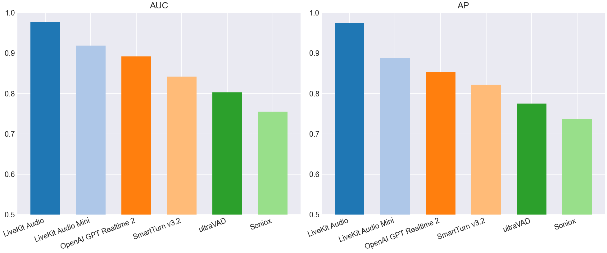
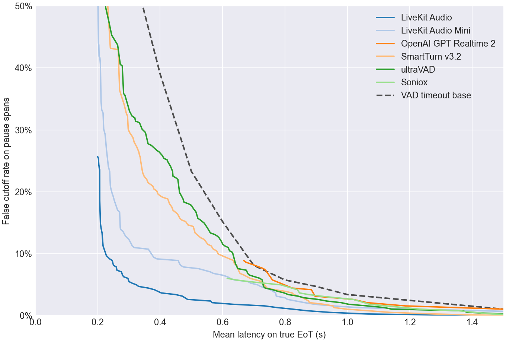
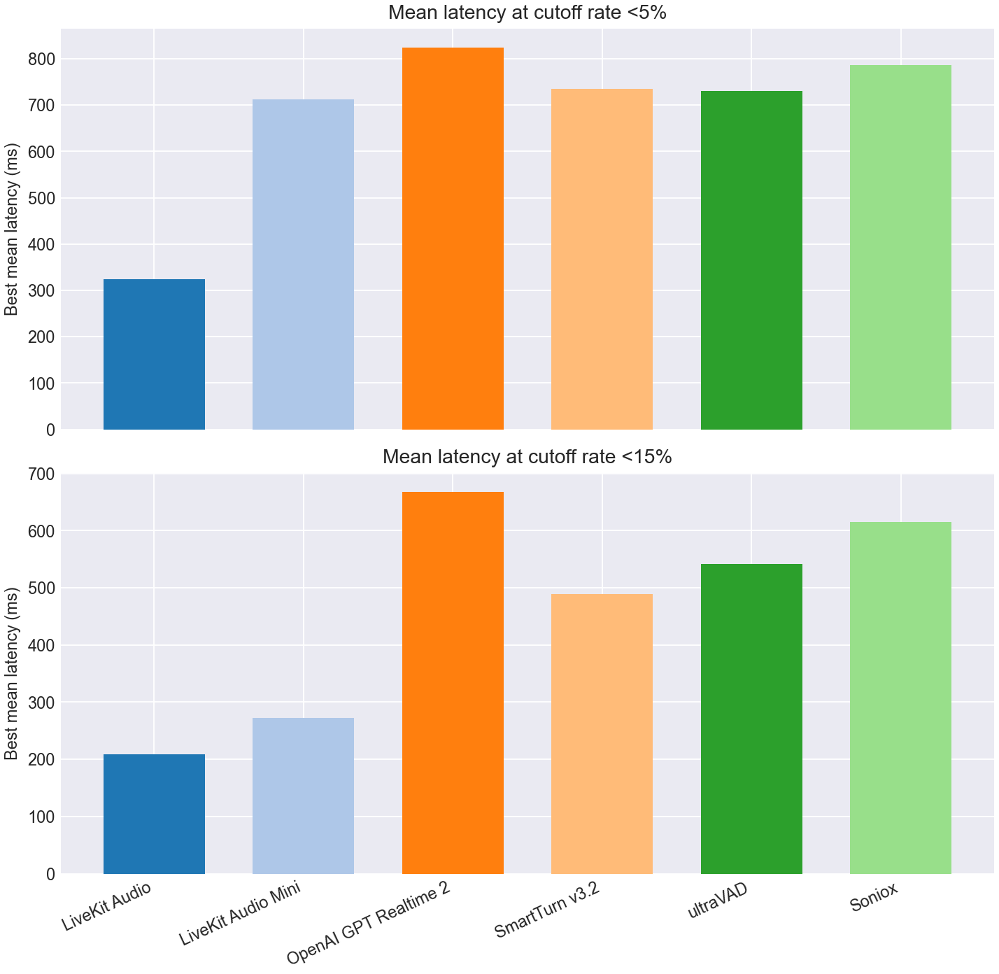
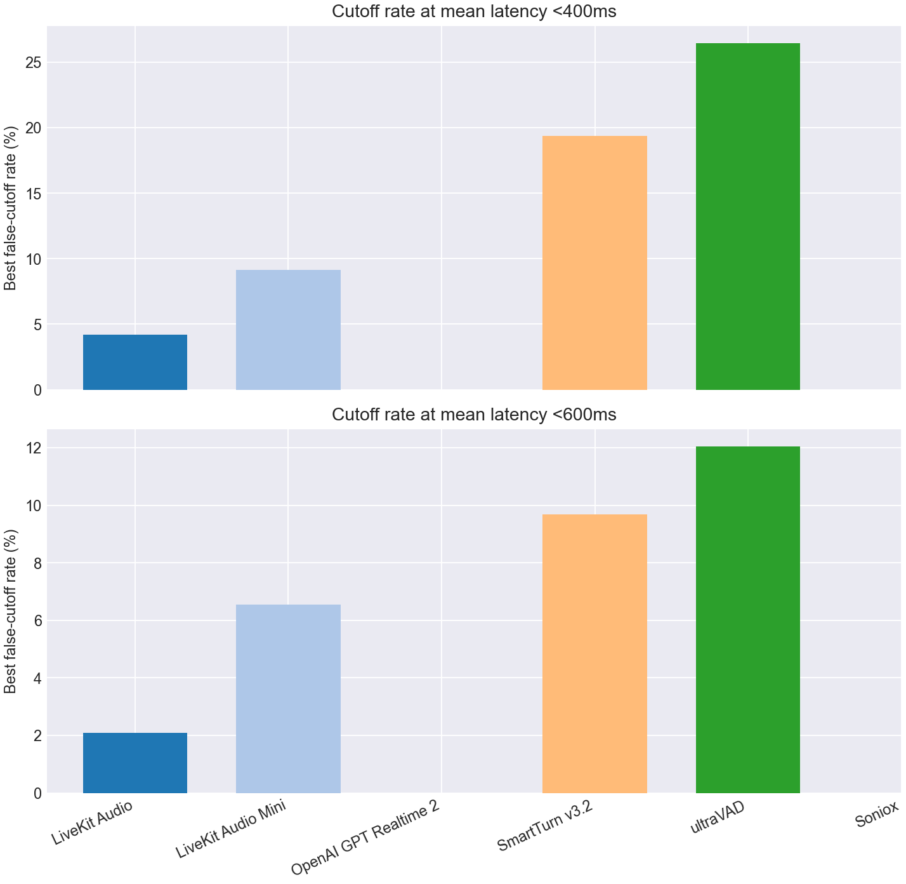

# EoT Model Comparison

## Classification Metrics Bar Charts

## Classification Metrics Table

| Model | Score Summary | Spans | AUC | AP | Mean Frontier Latency 0-10% |
| --- | --- | --- | --- | --- | --- |
| LiveKit Turn Detector v1 | 0.200 | 759 | 0.977 | 0.974 | 0.459 |
| LiveKit Turn Detector v1-mini | 0.200 | 759 | 0.919 | 0.889 | 0.804 |
| OpenAI GPT Realtime 2 | max | 759 | 0.892 | 0.852 | 1.003 |
| SmartTurn v3.2 | 0.200 | 759 | 0.842 | 0.822 | 0.803 |
| ultraVAD | 0.200 | 759 | 0.803 | 0.775 | 0.854 |
| Soniox | max | 759 | 0.755 | 0.737 | 0.863 |

## Pareto Curve

## Cutoff Budgets 5%, 15%

## Latency Budgets 400ms, 600ms

## Operating Points

| Type | Budget | Model | Mean Latency | Cutoff | Detect | Threshold | Action Delay | Timeout |
| --- | --- | --- | --- | --- | --- | --- | --- | --- |
| Cutoff | 5.0% | LiveKit Turn Detector v1 | 0.324 | 5.0% | 90.5% | 0.830 | 0.200 | 1.500 |
| Cutoff | 5.0% | LiveKit Turn Detector v1-mini | 0.712 | 5.0% | 87.5% | 0.460 | 0.600 | 1.500 |
| Cutoff | 5.0% | OpenAI GPT Realtime 2 | 0.824 | 4.5% | 87.5% | 0.990 | 0.700 | 1.500 |
| Cutoff | 5.0% | SmartTurn v3.2 | 0.734 | 5.0% | 88.6% | 0.040 | 0.700 | 1.000 |
| Cutoff | 5.0% | ultraVAD | 0.731 | 4.7% | 89.7% | 0.130 | 0.700 | 1.000 |
| Cutoff | 5.0% | Soniox | 0.786 | 5.0% | 53.6% | 0.990 | 0.600 | 1.000 |
| Cutoff | 15.0% | LiveKit Turn Detector v1 | 0.208 | 14.9% | 98.9% | 0.470 | 0.200 | 1.000 |
| Cutoff | 15.0% | LiveKit Turn Detector v1-mini | 0.272 | 14.1% | 91.0% | 0.400 | 0.200 | 1.000 |
| Cutoff | 15.0% | OpenAI GPT Realtime 2 | 0.668 | 8.9% | 87.0% | 0.990 | 0.200 | 1.000 |
| Cutoff | 15.0% | SmartTurn v3.2 | 0.489 | 14.7% | 63.9% | 0.950 | 0.200 | 1.000 |
| Cutoff | 15.0% | ultraVAD | 0.542 | 14.9% | 76.4% | 0.270 | 0.400 | 1.000 |
| Cutoff | 15.0% | Soniox | 0.615 | 6.0% | 53.6% | 0.990 | 0.200 | 1.000 |
| Latency | 400ms | LiveKit Turn Detector v1 | 0.381 | 4.2% | 89.9% | 0.840 | 0.200 | 2.000 |
| Latency | 400ms | LiveKit Turn Detector v1-mini | 0.390 | 9.2% | 85.4% | 0.490 | 0.200 | 1.500 |
| Latency | 400ms | OpenAI GPT Realtime 2 | - | - | - | - | - | - |
| Latency | 400ms | SmartTurn v3.2 | 0.399 | 19.4% | 75.1% | 0.790 | 0.200 | 1.000 |
| Latency | 400ms | ultraVAD | 0.397 | 26.4% | 86.2% | 0.180 | 0.300 | 1.000 |
| Latency | 400ms | Soniox | - | - | - | - | - | - |
| Latency | 600ms | LiveKit Turn Detector v1 | 0.566 | 2.1% | 84.4% | 0.880 | 0.300 | 2.000 |
| Latency | 600ms | LiveKit Turn Detector v1-mini | 0.599 | 6.5% | 57.3% | 0.690 | 0.300 | 1.000 |
| Latency | 600ms | OpenAI GPT Realtime 2 | - | - | - | - | - | - |
| Latency | 600ms | SmartTurn v3.2 | 0.598 | 9.7% | 80.4% | 0.470 | 0.500 | 1.000 |
| Latency | 600ms | ultraVAD | 0.595 | 12.0% | 80.9% | 0.230 | 0.500 | 1.000 |
| Latency | 600ms | Soniox | - | - | - | - | - | - |
