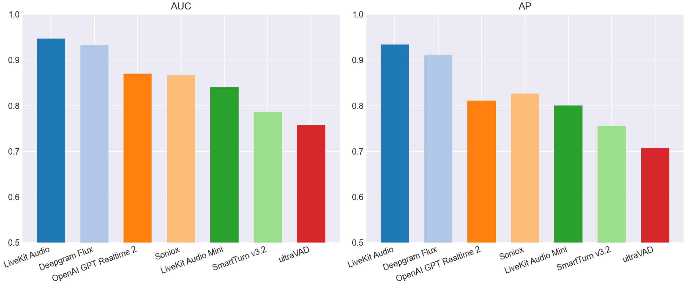
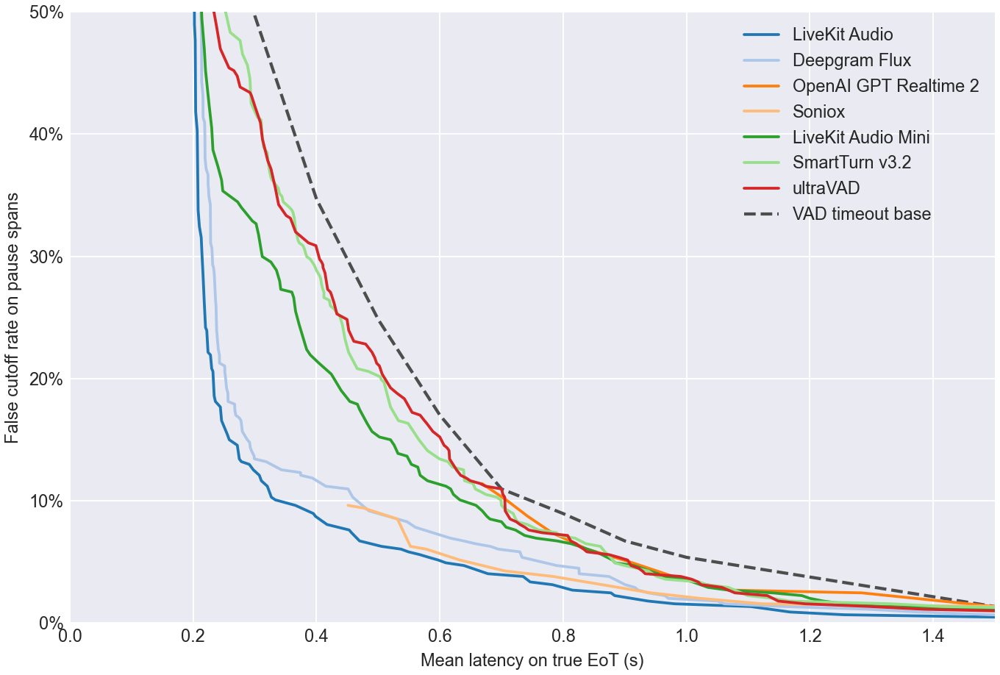
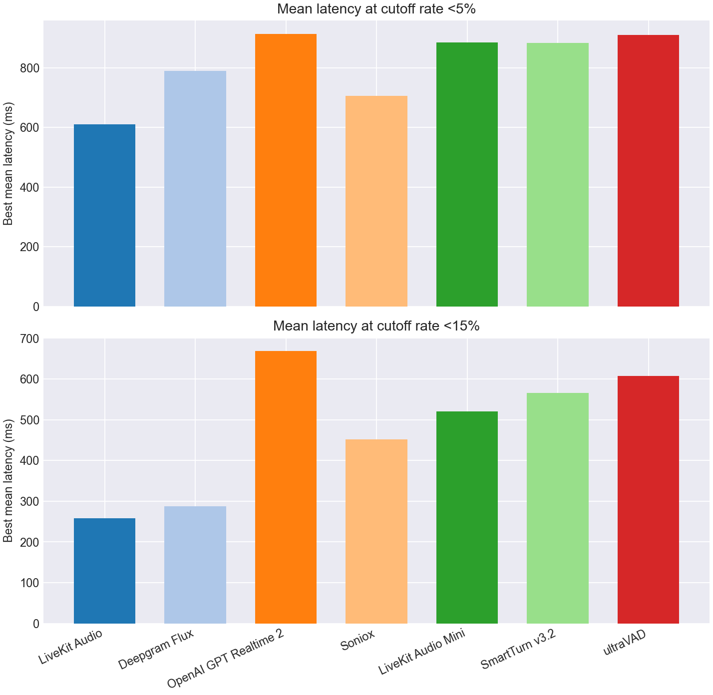
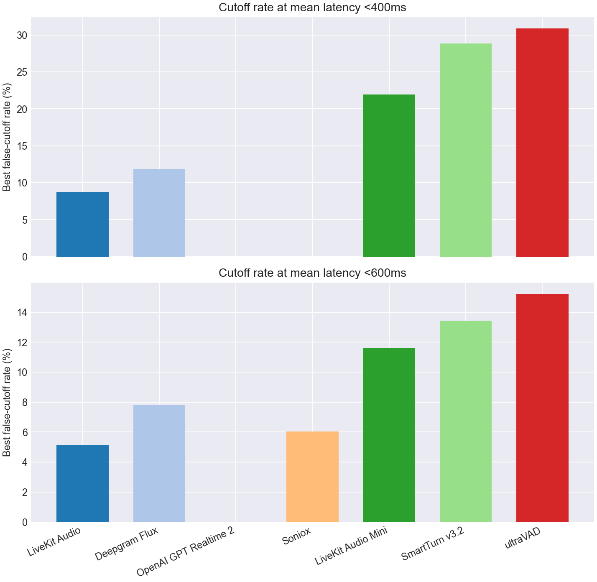

# EoT Model Comparison

## Classification Metrics Bar Charts

## Classification Metrics Table

| Model | Score Summary | Spans | AUC | AP | Mean Frontier Latency 0-10% |
| --- | --- | --- | --- | --- | --- |
| LiveKit Turn Detector v1 | 0.200 | 847 | 0.947 | 0.934 | 0.732 |
| Deepgram Flux | max | 847 | 0.933 | 0.910 | 0.855 |
| OpenAI GPT Realtime 2 | max | 847 | 0.871 | 0.811 | 1.180 |
| Soniox | max | 847 | 0.866 | 0.827 | 0.959 |
| LiveKit Turn Detector v1-mini | 0.200 | 847 | 0.840 | 0.800 | 1.064 |
| SmartTurn v3.2 | 0.200 | 847 | 0.786 | 0.756 | 1.090 |
| ultraVAD | 0.200 | 847 | 0.758 | 0.707 | 1.043 |

## Pareto Curve

## Cutoff Budgets 5%, 15%

## Latency Budgets 400ms, 600ms

## Operating Points

| Type | Budget | Model | Mean Latency | Cutoff | Detect | Threshold | Action Delay | Timeout |
| --- | --- | --- | --- | --- | --- | --- | --- | --- |
| Cutoff | 5.0% | LiveKit Turn Detector v1 | 0.610 | 4.9% | 68.5% | 0.950 | 0.200 | 1.500 |
| Cutoff | 5.0% | Deepgram Flux | 0.789 | 4.7% | 96.2% | 0.700 | 0.700 | 3.000 |
| Cutoff | 5.0% | OpenAI GPT Realtime 2 | 0.912 | 4.9% | 85.8% | 0.990 | 0.800 | 1.500 |
| Cutoff | 5.0% | Soniox | 0.706 | 4.3% | 79.8% | 0.990 | 0.500 | 1.500 |
| Cutoff | 5.0% | LiveKit Turn Detector v1-mini | 0.884 | 4.9% | 77.0% | 0.340 | 0.700 | 1.500 |
| Cutoff | 5.0% | SmartTurn v3.2 | 0.883 | 4.9% | 68.5% | 0.940 | 0.600 | 1.500 |
| Cutoff | 5.0% | ultraVAD | 0.910 | 4.7% | 73.8% | 0.200 | 0.700 | 1.500 |
| Cutoff | 15.0% | LiveKit Turn Detector v1 | 0.259 | 15.0% | 95.5% | 0.610 | 0.200 | 1.500 |
| Cutoff | 15.0% | Deepgram Flux | 0.288 | 15.0% | 96.5% | 0.630 | 0.200 | 1.500 |
| Cutoff | 15.0% | OpenAI GPT Realtime 2 | 0.668 | 11.4% | 84.0% | 0.990 | 0.200 | 1.000 |
| Cutoff | 15.0% | Soniox | 0.451 | 9.6% | 79.8% | 0.990 | 0.200 | 1.000 |
| Cutoff | 15.0% | LiveKit Turn Detector v1-mini | 0.520 | 15.0% | 60.0% | 0.440 | 0.200 | 1.000 |
| Cutoff | 15.0% | SmartTurn v3.2 | 0.566 | 15.0% | 54.2% | 0.980 | 0.200 | 1.000 |
| Cutoff | 15.0% | ultraVAD | 0.607 | 14.5% | 99.2% | 0.010 | 0.600 | 1.500 |
| Latency | 400ms | LiveKit Turn Detector v1 | 0.398 | 8.7% | 84.8% | 0.870 | 0.200 | 1.500 |
| Latency | 400ms | Deepgram Flux | 0.393 | 11.9% | 96.2% | 0.700 | 0.300 | 2.000 |
| Latency | 400ms | OpenAI GPT Realtime 2 | - | - | - | - | - | - |
| Latency | 400ms | Soniox | - | - | - | - | - | - |
| Latency | 400ms | LiveKit Turn Detector v1-mini | 0.390 | 21.9% | 76.2% | 0.350 | 0.200 | 1.000 |
| Latency | 400ms | SmartTurn v3.2 | 0.400 | 28.9% | 85.8% | 0.220 | 0.300 | 1.000 |
| Latency | 400ms | ultraVAD | 0.399 | 30.9% | 91.8% | 0.080 | 0.300 | 1.500 |
| Latency | 600ms | LiveKit Turn Detector v1 | 0.598 | 5.1% | 90.2% | 0.790 | 0.500 | 1.500 |
| Latency | 600ms | Deepgram Flux | 0.560 | 7.8% | 75.2% | 0.750 | 0.200 | 1.500 |
| Latency | 600ms | OpenAI GPT Realtime 2 | - | - | - | - | - | - |
| Latency | 600ms | Soniox | 0.578 | 6.0% | 79.8% | 0.990 | 0.300 | 1.500 |
| Latency | 600ms | LiveKit Turn Detector v1-mini | 0.580 | 11.6% | 52.5% | 0.500 | 0.200 | 1.000 |
| Latency | 600ms | SmartTurn v3.2 | 0.600 | 13.4% | 66.8% | 0.950 | 0.400 | 1.000 |
| Latency | 600ms | ultraVAD | 0.600 | 15.2% | 80.0% | 0.170 | 0.500 | 1.000 |
