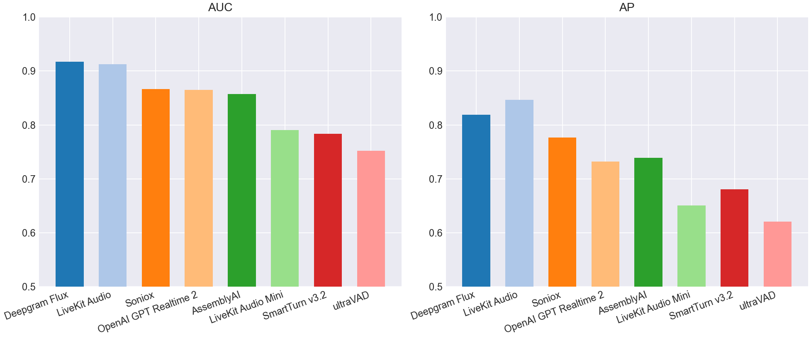
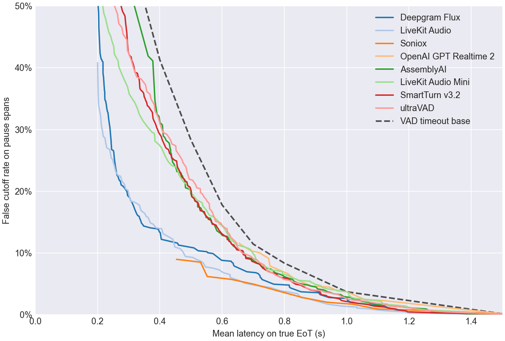
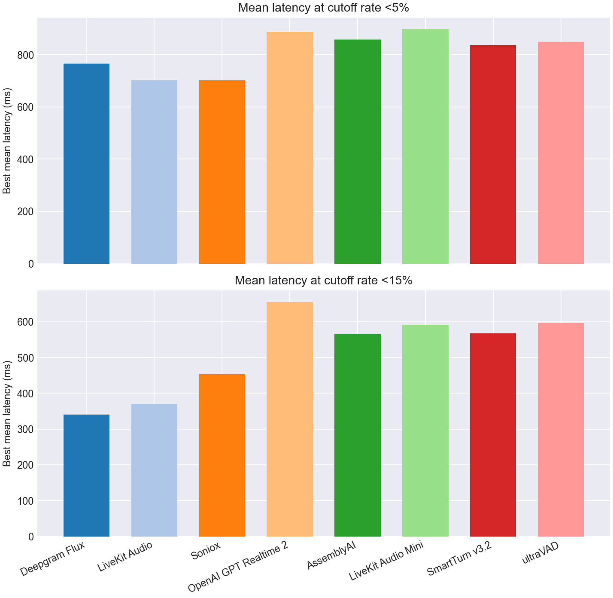
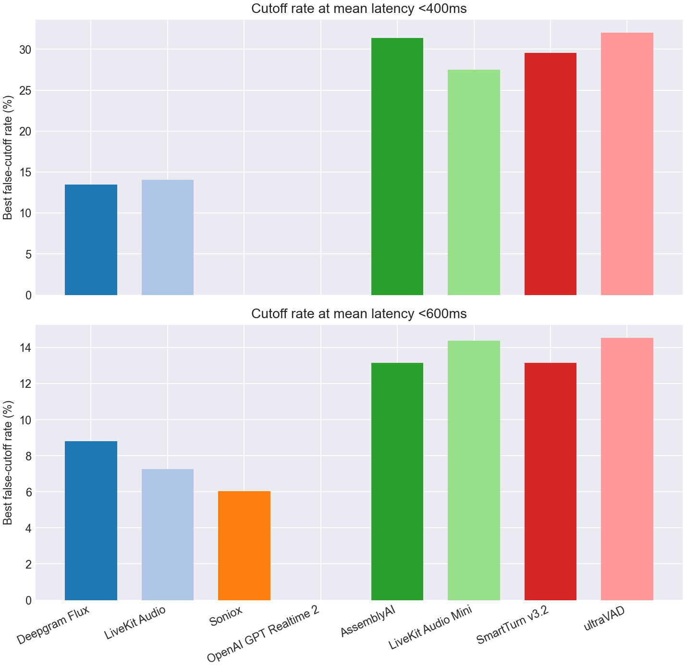

# EoT Model Comparison

## Classification Metrics Bar Charts

## Classification Metrics Table

| Model | Score Summary | Spans | AUC | AP | Mean Frontier Latency 0-10% |
| --- | --- | --- | --- | --- | --- |
| Deepgram Flux | max | 1047 | 0.917 | 0.819 | 0.859 |
| LiveKit Turn Detector v1 | 0.200 | 1047 | 0.913 | 0.847 | 0.766 |
| Soniox | max | 1047 | 0.867 | 0.777 | 0.794 |
| OpenAI GPT Realtime 2 | max | 1047 | 0.865 | 0.732 | 1.031 |
| AssemblyAI | max | 1047 | 0.857 | 0.739 | 0.923 |
| LiveKit Turn Detector v1-mini | 0.200 | 1047 | 0.790 | 0.651 | 0.948 |
| SmartTurn v3.2 | 0.200 | 1047 | 0.783 | 0.681 | 0.899 |
| ultraVAD | 0.200 | 1047 | 0.752 | 0.621 | 0.923 |

## Pareto Curve

## Cutoff Budgets 5%, 15%

## Latency Budgets 400ms, 600ms

## Operating Points

| Type | Budget | Model | Mean Latency | Cutoff | Detect | Threshold | Action Delay | Timeout |
| --- | --- | --- | --- | --- | --- | --- | --- | --- |
| Cutoff | 5.0% | Deepgram Flux | 0.766 | 4.9% | 93.2% | 0.710 | 0.700 | 1.500 |
| Cutoff | 5.0% | LiveKit Turn Detector v1 | 0.703 | 4.8% | 42.5% | 0.960 | 0.300 | 1.000 |
| Cutoff | 5.0% | Soniox | 0.702 | 4.9% | 80.2% | 0.990 | 0.500 | 1.500 |
| Cutoff | 5.0% | OpenAI GPT Realtime 2 | 0.888 | 4.6% | 88.8% | 0.990 | 0.800 | 1.500 |
| Cutoff | 5.0% | AssemblyAI | 0.858 | 4.9% | 49.0% | 0.950 | 0.700 | 1.000 |
| Cutoff | 5.0% | LiveKit Turn Detector v1-mini | 0.897 | 4.9% | 51.5% | 0.540 | 0.800 | 1.000 |
| Cutoff | 5.0% | SmartTurn v3.2 | 0.836 | 4.9% | 83.0% | 0.470 | 0.700 | 1.500 |
| Cutoff | 5.0% | ultraVAD | 0.849 | 4.9% | 50.2% | 0.440 | 0.700 | 1.000 |
| Cutoff | 15.0% | Deepgram Flux | 0.341 | 14.8% | 98.0% | 0.680 | 0.200 | 1.500 |
| Cutoff | 15.0% | LiveKit Turn Detector v1 | 0.370 | 14.8% | 78.8% | 0.780 | 0.200 | 1.000 |
| Cutoff | 15.0% | Soniox | 0.453 | 9.0% | 80.2% | 0.990 | 0.200 | 1.000 |
| Cutoff | 15.0% | OpenAI GPT Realtime 2 | 0.655 | 11.6% | 88.2% | 0.990 | 0.200 | 1.000 |
| Cutoff | 15.0% | AssemblyAI | 0.565 | 15.0% | 81.5% | 0.710 | 0.400 | 1.000 |
| Cutoff | 15.0% | LiveKit Turn Detector v1-mini | 0.591 | 14.7% | 81.8% | 0.360 | 0.500 | 1.000 |
| Cutoff | 15.0% | SmartTurn v3.2 | 0.568 | 14.7% | 54.0% | 0.970 | 0.200 | 1.000 |
| Cutoff | 15.0% | ultraVAD | 0.596 | 14.8% | 80.8% | 0.230 | 0.500 | 1.000 |
| Latency | 400ms | Deepgram Flux | 0.398 | 13.4% | 87.5% | 0.720 | 0.200 | 1.000 |
| Latency | 400ms | LiveKit Turn Detector v1 | 0.388 | 14.1% | 76.5% | 0.800 | 0.200 | 1.000 |
| Latency | 400ms | Soniox | - | - | - | - | - | - |
| Latency | 400ms | OpenAI GPT Realtime 2 | - | - | - | - | - | - |
| Latency | 400ms | AssemblyAI | 0.400 | 31.4% | 94.0% | 0.040 | 0.200 | 1.000 |
| Latency | 400ms | LiveKit Turn Detector v1-mini | 0.398 | 27.5% | 86.0% | 0.320 | 0.300 | 1.000 |
| Latency | 400ms | SmartTurn v3.2 | 0.396 | 29.5% | 75.5% | 0.790 | 0.200 | 1.000 |
| Latency | 400ms | ultraVAD | 0.394 | 32.0% | 86.5% | 0.190 | 0.300 | 1.000 |
| Latency | 600ms | Deepgram Flux | 0.598 | 8.8% | 93.2% | 0.710 | 0.500 | 1.500 |
| Latency | 600ms | LiveKit Turn Detector v1 | 0.591 | 7.3% | 58.5% | 0.910 | 0.300 | 1.000 |
| Latency | 600ms | Soniox | 0.579 | 6.0% | 80.2% | 0.990 | 0.300 | 1.500 |
| Latency | 600ms | OpenAI GPT Realtime 2 | - | - | - | - | - | - |
| Latency | 600ms | AssemblyAI | 0.596 | 13.1% | 75.8% | 0.790 | 0.400 | 1.000 |
| Latency | 600ms | LiveKit Turn Detector v1-mini | 0.600 | 14.4% | 80.0% | 0.370 | 0.500 | 1.000 |
| Latency | 600ms | SmartTurn v3.2 | 0.599 | 13.1% | 80.2% | 0.630 | 0.500 | 1.000 |
| Latency | 600ms | ultraVAD | 0.599 | 14.5% | 80.2% | 0.240 | 0.500 | 1.000 |
