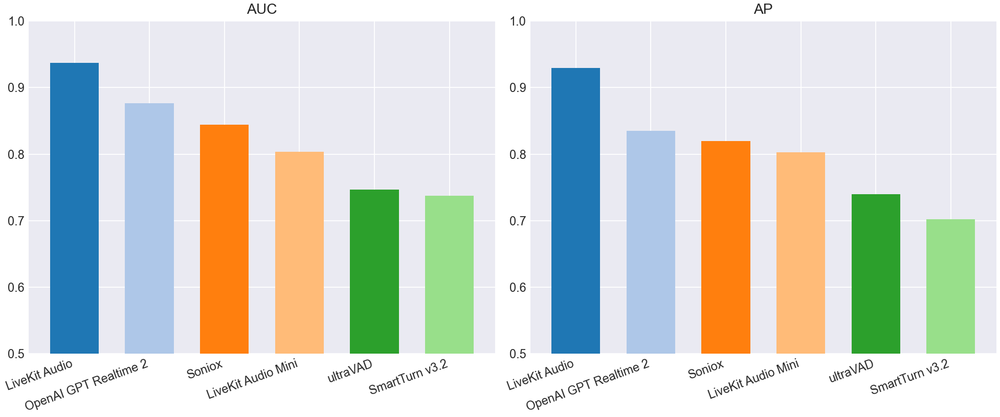
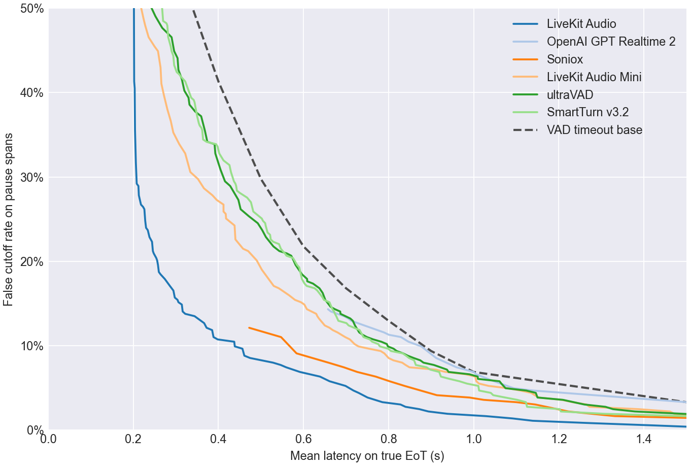
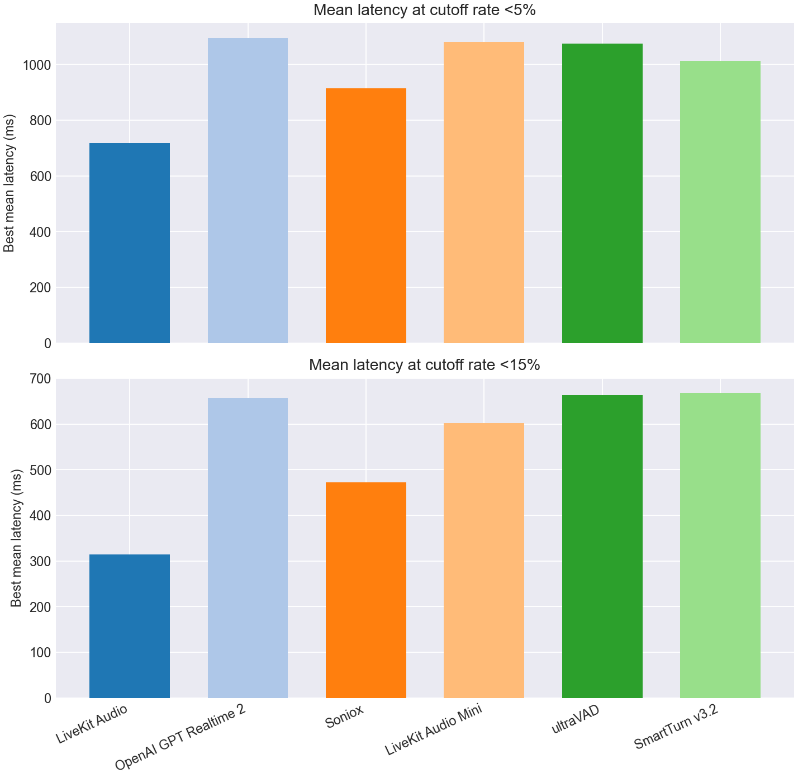
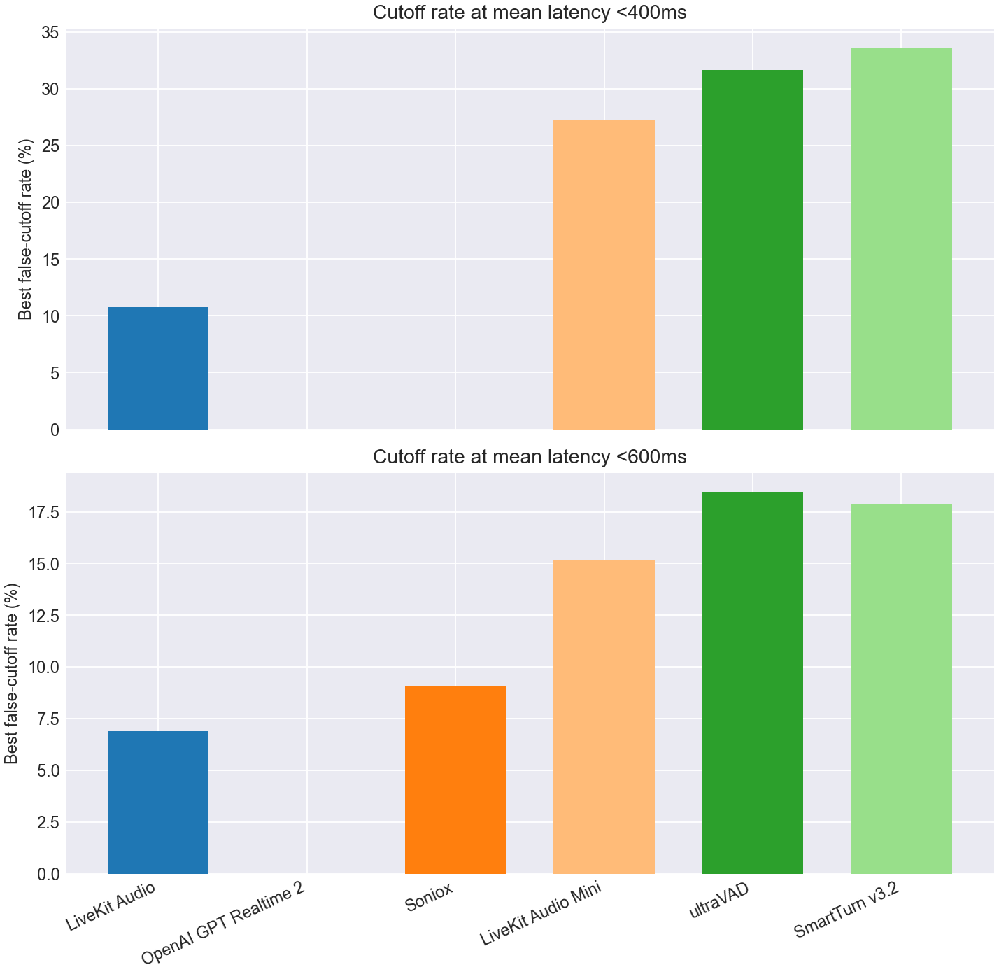

# EoT Model Comparison

## Classification Metrics Bar Charts

## Classification Metrics Table

| Model | Score Summary | Spans | AUC | AP | Mean Frontier Latency 0-10% |
| --- | --- | --- | --- | --- | --- |
| LiveKit Turn Detector v1 | 0.200 | 763 | 0.937 | 0.930 | 0.802 |
| OpenAI GPT Realtime 2 | max | 763 | 0.877 | 0.835 | 1.459 |
| Soniox | max | 763 | 0.844 | 0.820 | 1.121 |
| LiveKit Turn Detector v1-mini | 0.200 | 763 | 0.803 | 0.803 | 1.223 |
| ultraVAD | 0.200 | 763 | 0.746 | 0.740 | 1.263 |
| SmartTurn v3.2 | 0.200 | 763 | 0.738 | 0.702 | 1.213 |

## Pareto Curve

## Cutoff Budgets 5%, 15%

## Latency Budgets 400ms, 600ms

## Operating Points

| Type | Budget | Model | Mean Latency | Cutoff | Detect | Threshold | Action Delay | Timeout |
| --- | --- | --- | --- | --- | --- | --- | --- | --- |
| Cutoff | 5.0% | LiveKit Turn Detector v1 | 0.718 | 4.7% | 85.5% | 0.860 | 0.500 | 2.000 |
| Cutoff | 5.0% | OpenAI GPT Realtime 2 | 1.094 | 5.0% | 90.8% | 0.990 | 1.000 | 2.000 |
| Cutoff | 5.0% | Soniox | 0.913 | 4.1% | 78.0% | 0.990 | 0.600 | 2.000 |
| Cutoff | 5.0% | LiveKit Turn Detector v1-mini | 1.080 | 5.0% | 92.0% | 0.200 | 1.000 | 2.000 |
| Cutoff | 5.0% | ultraVAD | 1.075 | 5.0% | 85.0% | 0.120 | 1.000 | 1.500 |
| Cutoff | 5.0% | SmartTurn v3.2 | 1.013 | 4.7% | 89.8% | 0.340 | 0.900 | 2.000 |
| Cutoff | 15.0% | LiveKit Turn Detector v1 | 0.314 | 14.9% | 85.8% | 0.850 | 0.200 | 1.000 |
| Cutoff | 15.0% | OpenAI GPT Realtime 2 | 0.657 | 14.3% | 90.0% | 0.990 | 0.200 | 1.000 |
| Cutoff | 15.0% | Soniox | 0.472 | 12.1% | 77.8% | 0.990 | 0.200 | 1.000 |
| Cutoff | 15.0% | LiveKit Turn Detector v1-mini | 0.602 | 14.9% | 49.8% | 0.490 | 0.200 | 1.000 |
| Cutoff | 15.0% | ultraVAD | 0.664 | 14.6% | 67.2% | 0.210 | 0.500 | 1.000 |
| Cutoff | 15.0% | SmartTurn v3.2 | 0.668 | 14.3% | 83.0% | 0.710 | 0.600 | 1.000 |
| Latency | 400ms | LiveKit Turn Detector v1 | 0.398 | 10.7% | 84.8% | 0.870 | 0.200 | 1.500 |
| Latency | 400ms | OpenAI GPT Realtime 2 | - | - | - | - | - | - |
| Latency | 400ms | Soniox | - | - | - | - | - | - |
| Latency | 400ms | LiveKit Turn Detector v1-mini | 0.396 | 27.3% | 75.5% | 0.330 | 0.200 | 1.000 |
| Latency | 400ms | ultraVAD | 0.400 | 31.7% | 85.8% | 0.110 | 0.300 | 1.000 |
| Latency | 400ms | SmartTurn v3.2 | 0.398 | 33.6% | 86.0% | 0.570 | 0.300 | 1.000 |
| Latency | 600ms | LiveKit Turn Detector v1 | 0.592 | 6.9% | 78.2% | 0.920 | 0.200 | 2.000 |
| Latency | 600ms | OpenAI GPT Realtime 2 | - | - | - | - | - | - |
| Latency | 600ms | Soniox | 0.584 | 9.1% | 77.8% | 0.990 | 0.200 | 1.500 |
| Latency | 600ms | LiveKit Turn Detector v1-mini | 0.594 | 15.2% | 50.7% | 0.480 | 0.200 | 1.000 |
| Latency | 600ms | ultraVAD | 0.597 | 18.5% | 67.2% | 0.210 | 0.400 | 1.000 |
| Latency | 600ms | SmartTurn v3.2 | 0.596 | 17.9% | 80.8% | 0.790 | 0.500 | 1.000 |
