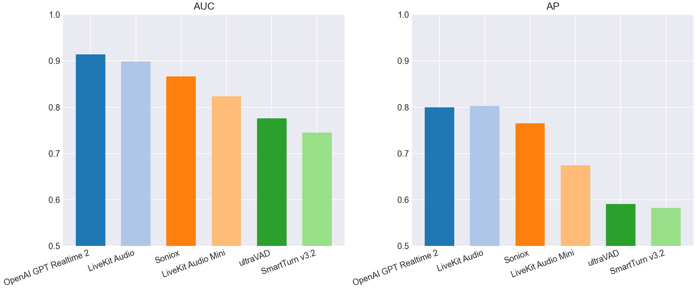
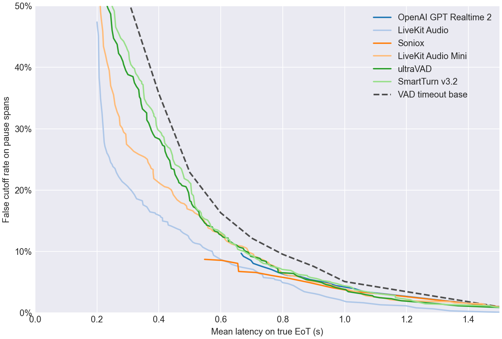
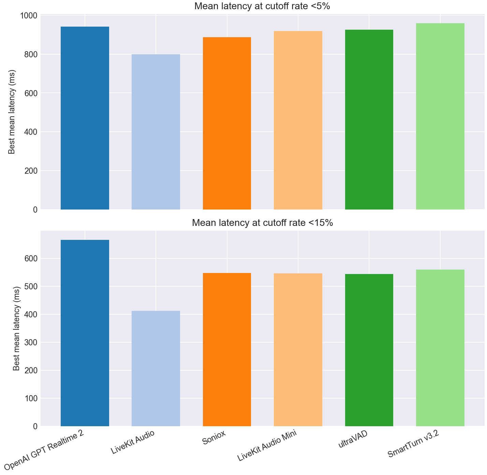
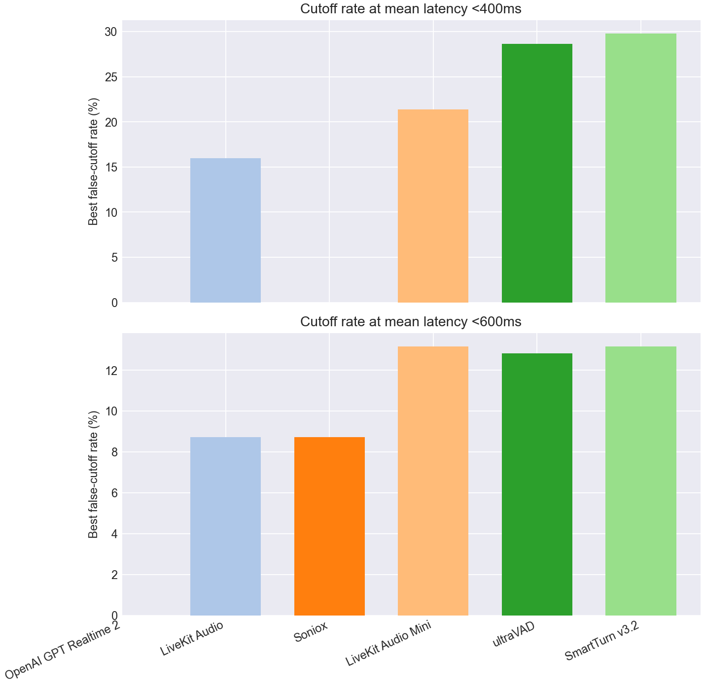

# EoT Model Comparison

## Classification Metrics Bar Charts

## Classification Metrics Table

| Model | Score Summary | Spans | AUC | AP | Mean Frontier Latency 0-10% |
| --- | --- | --- | --- | --- | --- |
| OpenAI GPT Realtime 2 | max | 952 | 0.914 | 0.800 | 1.110 |
| LiveKit Turn Detector v1 | 0.200 | 952 | 0.899 | 0.803 | 0.858 |
| Soniox | max | 952 | 0.866 | 0.765 | 1.050 |
| LiveKit Turn Detector v1-mini | 0.200 | 952 | 0.824 | 0.675 | 1.032 |
| ultraVAD | 0.200 | 952 | 0.776 | 0.591 | 1.017 |
| SmartTurn v3.2 | 0.200 | 952 | 0.745 | 0.582 | 1.045 |

## Pareto Curve

## Cutoff Budgets 5%, 15%

## Latency Budgets 400ms, 600ms

## Operating Points

| Type | Budget | Model | Mean Latency | Cutoff | Detect | Threshold | Action Delay | Timeout |
| --- | --- | --- | --- | --- | --- | --- | --- | --- |
| Cutoff | 5.0% | OpenAI GPT Realtime 2 | 0.941 | 4.9% | 93.9% | 0.990 | 0.900 | 1.500 |
| Cutoff | 5.0% | LiveKit Turn Detector v1 | 0.799 | 4.9% | 70.1% | 0.810 | 0.500 | 1.500 |
| Cutoff | 5.0% | Soniox | 0.886 | 4.9% | 79.4% | 0.990 | 0.700 | 1.500 |
| Cutoff | 5.0% | LiveKit Turn Detector v1-mini | 0.919 | 4.9% | 72.7% | 0.420 | 0.700 | 1.500 |
| Cutoff | 5.0% | ultraVAD | 0.926 | 4.9% | 82.0% | 0.270 | 0.800 | 1.500 |
| Cutoff | 5.0% | SmartTurn v3.2 | 0.959 | 4.9% | 77.3% | 0.560 | 0.800 | 1.500 |
| Cutoff | 15.0% | OpenAI GPT Realtime 2 | 0.666 | 9.7% | 93.3% | 0.990 | 0.200 | 1.000 |
| Cutoff | 15.0% | LiveKit Turn Detector v1 | 0.412 | 15.0% | 84.0% | 0.670 | 0.300 | 1.000 |
| Cutoff | 15.0% | Soniox | 0.548 | 8.7% | 77.0% | 0.990 | 0.200 | 1.000 |
| Cutoff | 15.0% | LiveKit Turn Detector v1-mini | 0.547 | 15.0% | 90.7% | 0.250 | 0.500 | 1.000 |
| Cutoff | 15.0% | ultraVAD | 0.544 | 15.0% | 91.3% | 0.160 | 0.500 | 1.000 |
| Cutoff | 15.0% | SmartTurn v3.2 | 0.560 | 15.0% | 88.1% | 0.130 | 0.500 | 1.000 |
| Latency | 400ms | OpenAI GPT Realtime 2 | - | - | - | - | - | - |
| Latency | 400ms | LiveKit Turn Detector v1 | 0.398 | 16.0% | 86.0% | 0.640 | 0.300 | 1.000 |
| Latency | 400ms | Soniox | - | - | - | - | - | - |
| Latency | 400ms | LiveKit Turn Detector v1-mini | 0.396 | 21.4% | 86.3% | 0.310 | 0.300 | 1.000 |
| Latency | 400ms | ultraVAD | 0.387 | 28.6% | 87.5% | 0.210 | 0.300 | 1.000 |
| Latency | 400ms | SmartTurn v3.2 | 0.398 | 29.8% | 86.0% | 0.220 | 0.300 | 1.000 |
| Latency | 600ms | OpenAI GPT Realtime 2 | - | - | - | - | - | - |
| Latency | 600ms | LiveKit Turn Detector v1 | 0.599 | 8.7% | 57.3% | 0.870 | 0.300 | 1.000 |
| Latency | 600ms | Soniox | 0.548 | 8.7% | 77.0% | 0.990 | 0.200 | 1.000 |
| Latency | 600ms | LiveKit Turn Detector v1-mini | 0.584 | 13.2% | 83.1% | 0.340 | 0.500 | 1.000 |
| Latency | 600ms | ultraVAD | 0.594 | 12.8% | 81.1% | 0.280 | 0.500 | 1.000 |
| Latency | 600ms | SmartTurn v3.2 | 0.599 | 13.2% | 80.2% | 0.400 | 0.500 | 1.000 |
